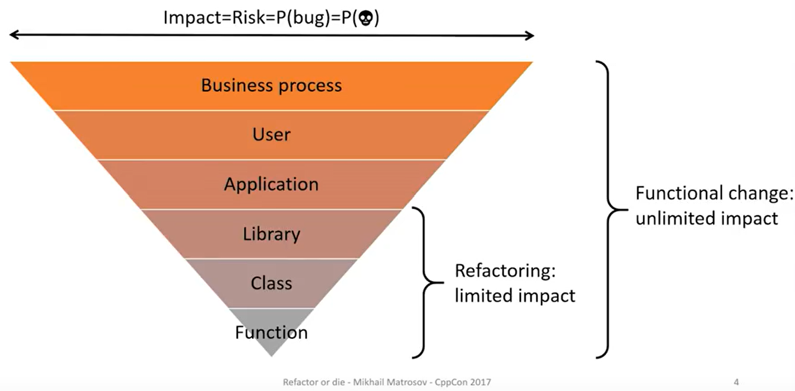
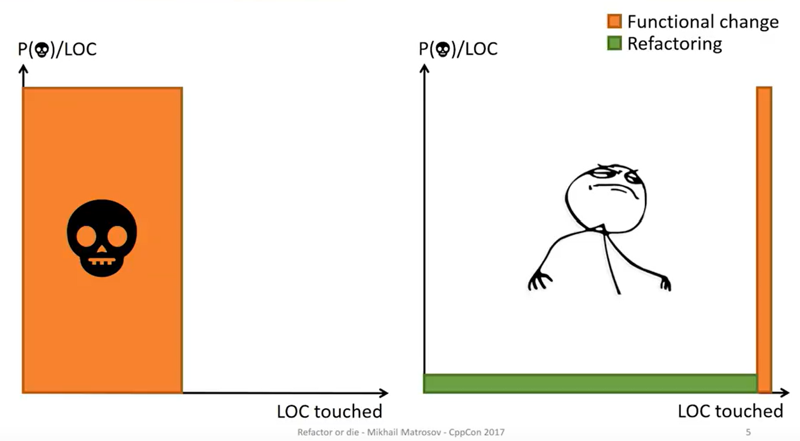

.. include:: replace.txt
.. heading hierarchy:
   ------------- Chapter
   ************* Section (#.#)
   ============= Subsection (#.#.#)
   ############# Paragraph (no number)

.. _Best practices:

Best practices
--------------

When writing code to be contributed to the |ns3| open source project, we
recommend following the best practices listed below.
These practices apply to different phases of software development and testing,
and are organized according to the typical application lifecycle.

Development phase
*****************

Refactor-or-die: Preliminary refactoring before introducing functional changes
==============================================================================

As presented in Mikhail Matrosov's "Refactor or die" talk in CppCon 2017 [`1`_], mixing refactoring and functional
changes is a bad practice.

It is considered a bad practice because refactoring may involve a lot
of different files, classes, API changes to accommodate new parameters, for example.
If a functional change is mixed in between, there is a higher
probability of introducing a bug. This results in more code to inspect and debug
to isolate and fix the bug. Which translates to unproductive work to isolate and
fix the bug, which results in extra hours, working on weekends, etc, etc.

The figure below depicts the scope differences in refactoring and functional changes.

    Impact of different scope changes (inverted triangle), and scopes affected
    by refactoring and functional changes. [`1`_]

This is why refactoring should be done as a preliminary step,
before functional changes. This will drastically reduce the number
of lines of code which may have introduced a potential bug,
saving development/maintenance time in the long run.

The figure below depicts the effects of mixed refactoring AND functional changes (left orange rectangle),
versus the preliminary refactoring (right green rectangle) PLUS functional changes (right orange rectangle).

    Assume the existence of a bug kills you. If you mix functional and refactoring changes, the number
    of lines potentially containing a bug increases. As such, the probability of dying is unnecessarily
    augmented. If you do not mix these changes, the probability of dying is significantly reduced. [`1`_]

Compile-or-die: Individual commit compilation and testing
#########################################################

Since preliminary refactoring is not always trivial, due to the potentially unknown requirements,
it is very unlikely to completely avoid mixing refactoring and functional changes.
However, these changes can and should be separated before merging them upstream.

This can be achieved through commit history rewriting, which can also introduce new bugs,
if commits are not properly rewritten.

A suggested practice is to at least compile and run tests for every single commit
in the branch before merging it. This can be accomplished by checking out each commit,
hard-resetting to that commit, reconfiguring the project and running test.py.

This can be done automatically using `./ns3 --compile-or-die base_commit head_commit`.

Note: ALWAYS back up your ns-3 directory and sync your local branches with the remote server.

.. sourcecode:: console

    ~ns-3-dev/$ ./ns3 --compile-or-die 757a2bfc2abb5f3584593609434c40e5ac678e8e 5a30398332d70646279285a2ef8997cea0ed9e43
    Compile-or-die with commits: ['757a2bfc2abb5f3584593609434c40e5ac678e8e', '5a30398332d70646279285a2ef8997cea0ed9e43']
            Testing commit 757a2bfc2abb5f3584593609434c40e5ac678e8e
            Testing commit 5a30398332d70646279285a2ef8997cea0ed9e43

In case there are uncommitted changes, the script won't continue to prevent potential data loss.
In case there is no associated branch with the current git head, a backup branch will be created
to prevent data loss.
Then it will create a new temporary test branch, that will be used to checkout and test each
commit between base and head commits.

If there is no error message, all commits succeed. Which only means there is no issue preventing
compilation or causing one of the existing tests to fail. That is, we have anecdotal evidence that
refactoring was done correctly.

Two branches are created automatically: the current HEAD is tagged as ``compileOrDieBackup`` if not currently tagged,
and the commit being currently tested is tagged as ``compileOrDieTest``. These won't be cleaned automatically to
prevent potential data loss. So users should verify and delete tags manually.

.. _1:

[1] Mikhail Matrosov. Refactor or die. CppCon 2017. Available in `YouTube <https://youtu.be/fzmjXK9JZ9o>`_.
