.. include:: replace.txt
.. highlight:: console

.. _Getting Started:

Getting Started
---------------

This section is aimed at getting a user to a working state starting
with a machine that may never have had |ns3| installed.  It covers
supported platforms, prerequisites, ways to obtain |ns3|, ways to
build |ns3|, and ways to verify your build and run simple programs.

Overview
********

|ns3| is built as a system of software libraries that work together.
User programs can be written that links with (or imports from) these
libraries.  User programs are written in either the C++ or Python
programming languages.

|ns3| is distributed as source code, meaning that the target system
needs to have a software development environment to build the libraries
first, then build the user program.  |ns3| could in principle be
distributed as pre-built libraries for selected systems, and in the
future it may be distributed that way, but at present, many users
actually do their work by editing |ns3| itself, so having the source
code around to rebuild the libraries is useful.  If someone would like
to undertake the job of making pre-built libraries and packages for
operating systems, please contact the ns-developers mailing list.

In the following, we'll look at three ways of downloading and building
|ns3|.  The first is to download and build an official release
from the main web site.  The second is to fetch and build development
copies of a basic |ns3| installation.  The third is to use an additional
build tool to download more extensions for |ns3|.  We'll walk through each
since the tools involved are slightly different.

Experienced Linux users may wonder at this point why |ns3| is not provided
like most other libraries using a package management tool?  Although there
exist some binary packages for various Linux distributions (e.g. Debian),
most users end up editing and having to rebuild the |ns3| libraries
themselves, so having the source code available is more convenient.
We will therefore focus on a source installation in this tutorial.

For most uses of |ns3|, root permissions are not needed, and the use of
a non-privileged user account is recommended.

Prerequisites
*************

The entire set of available |ns3| libraries has a number of dependencies
on third-party libraries, but most of |ns3| can be built and used with
support for a few common (often installed by default) components:  a
C++ compiler, an installation of Python, a source code editor (such as vim,
emacs, or Eclipse) and, if using the development repositories, an
installation of Git source code control system.  Most beginning users
need not concern themselves if their configuration reports some missing
optional features of |ns3|, but for those wishing a full installation,
the project provides an installation guide
for various systems, available at
https://www.nsnam.org/docs/installation/html/index.html.

As of the most recent |ns3| release (ns-3.44), the following tools
are needed to get started with |ns3|:

============  ===========================================================
Prerequisite  Package/version
============  ===========================================================
C++ compiler  ``clang++`` or ``g++`` (g++ version 9 or greater)
Python        ``python3`` version >=3.8
CMake         ``cmake`` version >=3.13
Build system  ``make``, ``ninja``, ``xcodebuild`` (XCode)
Git           any recent version (to access |ns3| from `GitLab.com <https://gitlab.com/nsnam/ns-3-dev/>`_)
tar           any recent version (to unpack an `ns-3 release <https://www.nsnam.org/releases/>`_)
bunzip2       any recent version (to uncompress an |ns3| release)
============  ===========================================================

To check the default version of Python, type ``python -V``.  To check
the default version of g++, type ``g++ -v``.  If your installation is
missing or too old, please consult the |ns3|
`installation guide <https://www.nsnam.org/docs/installation/html/index.html>`_ for guidance.

From this point forward, we are going to assume that the reader is working in
Linux, macOS, or a Linux emulation environment, and has at least the above
prerequisites.

For example, do not use a directory path such as the below, because one
of the parent directories contains a space in the directory name:

.. sourcecode:: console

  $ pwd
  /home/user/5G simulations/ns-3-allinone/ns-3-dev

Downloading a release of ns-3 as a source archive
+++++++++++++++++++++++++++++++++++++++++++++++++

This option is for the new user who wishes to download and experiment with
the most recently released and packaged version of |ns3|.
|ns3| publishes its releases as compressed source archives, sometimes
referred to as a tarball.
A tarball is a particular format of software archive where multiple
files are bundled together and the archive is usually compressed.
The process for downloading |ns3| via tarball is simple; you just
have to pick a release, download it and uncompress it.

Let's assume that you, as a user, wish to build |ns3| in a local
directory called ``workspace``.
If you adopt the ``workspace`` directory approach, you can
get a copy of a release by typing the following into your Linux shell
(substitute the appropriate version numbers, of course)

.. sourcecode:: console

  $ cd
  $ mkdir workspace
  $ cd workspace
  $ wget https://www.nsnam.org/release/ns-allinone-3.44.tar.bz2
  $ tar xjf ns-allinone-3.44.tar.bz2

Notice the use above of the ``wget`` utility, which is a command-line
tool to fetch objects from the web; if you do not have this installed,
you can use a browser for this step.

Following these steps, if you change into the directory
``ns-allinone-3.44``, you should see a number of files and directories

.. sourcecode:: text

  $ cd ns-allinone-3.44
  $ ls
  bake  build.py  constants.py  netanim-3.109 ns-3.44  README.md  util.py

You are now ready to build the base |ns3| distribution and may skip ahead
to the section on building |ns3|.

Downloading ns-3 using Git
**************************

The |ns3| code is available in Git repositories on the GitLab.com service
at https://gitlab.com/nsnam/.  The group name ``nsnam`` organizes the
various repositories used by the open source project.

The simplest way to get started using Git repositories is to fork or clone
the ``ns-3-allinone`` environment.  This is a set of scripts that manages the
downloading and building of the most commonly used subsystems of |ns3|
for you.  If you are new to Git, the terminology of ``fork`` and ``clone``
may be foreign to you; if so, we recommend that you simply ``clone``
(create your own replica) of the repository found on GitLab.com, as
follows:

.. sourcecode:: console

  $ cd
  $ mkdir workspace
  $ cd workspace
  $ git clone https://gitlab.com/nsnam/ns-3-allinone.git
  $ cd ns-3-allinone

At this point, your view of the ns-3-allinone directory is slightly
different than described above with a release archive; it should look
something like this:

.. sourcecode:: console

  $ ls
  build.py  constants.py   download.py  README.md  util.py

Note the presence of the ``download.py`` script, which will further fetch
the |ns3| and related sourcecode.  At this point, you have a choice, to
either download the most recent development snapshot of |ns3|:

.. sourcecode:: console

  $ python3 download.py

or to specify a release of |ns3|, using the ``-n`` flag to specify a
release number:

.. sourcecode:: console

  $ python3 download.py -n ns-3.44

After this step, the additional repositories of |ns3|, bake, pybindgen,
and netanim will be downloaded to the ``ns-3-allinone`` directory.

Downloading ns-3 Using Bake
+++++++++++++++++++++++++++

The above two techniques (source archive, or ns-3-allinone repository
via Git) are useful to get the most basic installation of |ns3| with a
few addons (pybindgen for generating Python bindings, and netanim
for network animations).  The third repository provided by default in
ns-3-allinone is called ``bake``.

Bake is a tool for coordinated software building from multiple repositories,
developed for the |ns3| project. Bake can be used to fetch development
versions of the |ns3| software, and to download and build extensions to the
base |ns3| distribution, such as the Direct Code Execution environment,
Network Simulation Cradle, ability to create new Python bindings, and
various |ns3| "apps".  If you envision that your |ns3| installation may
use advanced or optional features, you may wish to follow this installation
path.

In recent |ns3| releases, Bake has been included in the release
tarball.  The configuration file included in the released version
will allow one to download any software that was current at the
time of the release.  That is, for example, the version of Bake that
is distributed with the ``ns-3.30`` release can be used to fetch components
for that |ns3| release or earlier, but can't be used to fetch components
for later releases (unless the ``bakeconf.xml`` package description file
is updated).

You can also get the most recent copy of ``bake`` by typing the
following into your Linux shell (assuming you have installed Git)::

  $ cd
  $ mkdir workspace
  $ cd workspace
  $ git clone https://gitlab.com/nsnam/bake.git

As the git command executes, you should see something like the
following displayed:

.. sourcecode:: console

  Cloning into 'bake'...
  remote: Enumerating objects: 2086, done.
  remote: Counting objects: 100% (2086/2086), done.
  remote: Compressing objects: 100% (649/649), done.
  remote: Total 2086 (delta 1404), reused 2078 (delta 1399)
  Receiving objects: 100% (2086/2086), 2.68 MiB | 3.82 MiB/s, done.
  Resolving deltas: 100% (1404/1404), done.

After the clone command completes, you should have a directory called
``bake``, the contents of which should look something like the following:

.. sourcecode:: console

  $ cd bake
  $ ls
  bake  bakeconf.xml  bake.py  doc  examples  generate-binary.py  test  TODO

Notice that you have downloaded some Python scripts, a Python
module called ``bake``, and an XML configuration file.  The next step
will be to use those scripts to download and build the |ns3|
distribution of your choice.

There are a few configuration targets available:

1.  ``ns-3.44``:  the code corresponding to the release
2.  ``ns-3-dev``:  a similar module but using the development code tree
3.  ``ns-allinone-3.44``:  the module that includes other optional features
    such as bake build system, netanim animator, and pybindgen
4.  ``ns-3-allinone``:  similar to the released version of the allinone
    module, but for development code.

The current development snapshot (unreleased) of |ns3| may be found
and cloned from https://gitlab.com/nsnam/ns-3-dev.git.  The
developers attempt to keep these repositories in consistent, working states but
they are in a development area with unreleased code present, so you may want
to consider staying with an official release if you do not need newly-
introduced features.

You can find the latest version  of the
code either by inspection of the repository list or by going to the
`"ns-3 Releases"
<https://www.nsnam.org/releases>`_
web page and clicking on the latest release link.  We'll proceed in
this tutorial example with ``ns-3.44``.

We are now going to use the bake tool to pull down the various pieces of
|ns3| you will be using.  First, we'll say a word about running bake.

Bake works by downloading source packages into a source directory,
and installing libraries into a build directory.  bake can be run
by referencing the binary, but if one chooses to run bake from
outside of the directory it was downloaded into, it is advisable
to put bake into your path, such as follows (Linux bash shell example).
First, change into the 'bake' directory, and then set the following
environment variables:

.. sourcecode:: console

  $ export BAKE_HOME=`pwd`
  $ export PATH=$PATH:$BAKE_HOME/build/bin
  $ export PYTHONPATH=$BAKE_HOME/build/lib
  $ export LD_LIBRARY_PATH=$BAKE_HOME/build/lib

This will put the bake.py program into the shell's path, and will allow
other programs to find executables and libraries created by bake.  Although
several bake use cases do not require setting PATH and PYTHONPATH as above,
full builds of ns-3-allinone (with the optional packages) typically do.

Step into the workspace directory and type the following into your shell:

.. sourcecode:: console

  $ ./bake.py configure -e ns-allinone-3.44

Next, we'll ask bake to check whether we have enough tools to download
various components.  Type:

.. sourcecode:: console

  $ ./bake.py check

You should see something like the following:

.. sourcecode:: text

  > Python - OK
  > GNU C++ compiler - OK
  > Git - OK
  > Tar tool - OK
  > Unzip tool - OK
  > Make - OK
  > cMake - OK
  > patch tool - OK
  > Path searched for tools: /usr/local/sbin /usr/local/bin /usr/sbin /usr/bin /sbin /bin ...

Please install missing tools at this stage, in the usual
way for your system (if you are able to), or contact your system
administrator as needed to install these tools.

Next, try to download the software:

.. sourcecode:: console

  $ ./bake.py download

should yield something like:

.. sourcecode:: text

  >> Searching for system dependency libxml2-dev - OK
  >> Searching for system dependency gi-cairo - OK
  >> Searching for system dependency gir-bindings - OK
  >> Searching for system dependency pygobject - OK
  >> Searching for system dependency pygraphviz - OK
  >> Searching for system dependency python3-dev - OK
  >> Searching for system dependency qt - OK
  >> Searching for system dependency g++ - OK
  >> Searching for system dependency cmake - OK
  >> Downloading netanim-3.109 - OK
  >> Downloading click-ns-3.37 - OK
  >> Downloading BRITE - OK
  >> Downloading openflow-dev - OK
  >> Downloading ns-3.44 (target directory:ns-3.44) - OK

The above suggests that three sources have been downloaded.  Check the
``source`` directory now and type ``ls``; one should see:

.. sourcecode:: console

  $ cd source
  $ ls
  BRITE  click-ns-3.37  netanim-3.109  ns-3.44  openflow-dev

You are now ready to build the |ns3| distribution.

Building ns-3
*************

As with downloading |ns3|, there are a few ways to build |ns3|.  The main
thing that we wish to emphasize is the following.  |ns3| is built with
a build tool called ``CMake``, described below.  Most users will end up
working most directly with the ns3 command-line wrapper for CMake, for the sake
of convenience.  Therefore, please have a look at ``build.py`` and building
with ``bake``, before reading about CMake and the ns3 wrapper below.

Building with ``build.py``
++++++++++++++++++++++++++

**Note:** This build step is only available from a source archive release
described above; not from downloading via git or bake.

When working from a released tarball, a convenience script available as
part of ``ns-3-allinone`` can orchestrate a simple build of components.
This program is called ``build.py``.  This
program will get the project configured for you
in the most commonly useful way.  However, please note that more advanced
configuration and work with |ns3| will typically involve using the
native |ns3| build system, CMake, to be introduced later in this tutorial.

If you downloaded
using a tarball you should have a directory called something like
``ns-allinone-3.44`` under your ``~/workspace`` directory.
Type the following:

.. sourcecode:: console

  $ ./build.py --enable-examples --enable-tests

Because we are working with examples and tests in this tutorial, and
because they are not built by default in |ns3|, the arguments for
build.py tells it to build them for us.  The program also defaults to
building all available modules.  Later, you can build
|ns3| without examples and tests, or eliminate the modules that
are not necessary for your work, if you wish.

You will see lots of compiler output messages displayed as the build
script builds the various pieces you downloaded.  First, the script will
attempt to build the netanim animator, and then |ns3|.

Building with bake
++++++++++++++++++

If you used bake above to fetch source code from project repositories, you
may continue to use it to build |ns3|.  Type:

.. sourcecode:: console

  $ ./bake.py build

and you should see something like:

.. sourcecode:: text

  >> Building netanim-3.109 - OK
  >> Building ns-3.44 - OK

There may be failures to build all components, but the build will proceed
anyway if the component is optional.

If there happens to be a failure, please have a look at what the following
command tells you; it may give a hint as to a missing dependency:

.. sourcecode:: console

  $ ./bake.py show

This will list out the various dependencies of the packages you are
trying to build.

Building with the ns3 CMake wrapper
+++++++++++++++++++++++++++++++++++

Up to this point, we have used either the `build.py` script, or the
`bake` tool, to get started with building |ns3|.  These tools are useful
for building |ns3| and supporting libraries, and they call into
the |ns3| directory to call the CMake build tool to do the actual building.
CMake needs to be installed before building |ns3|.
So, to proceed, please change your working directory to
the |ns3| directory that you have initially built.

It's not
strictly required at this point, but it will be valuable to take a slight
detour and look at how to make changes to the configuration of the project.
Probably the most useful configuration change you can make will be to
build the optimized version of the code. The project will be configured
by default using the ``default`` build profile, which is an optimized
build with debug information (CMAKE_BUILD_TYPE=relwithdebinfo) version.
Let's tell the project to make an optimized build.

To maintain a similar interface for command-line users, we include a
wrapper script for CMake, |ns3|. To tell |ns3| that it should do optimized
builds that include the examples and tests, you will need to execute the
following commands:

.. sourcecode:: console

  $ ./ns3 clean
  $ ./ns3 configure --build-profile=optimized --enable-examples --enable-tests

This runs CMake out of the local directory (which is provided as a convenience
for you).  The first command to clean out the previous build is not
typically strictly necessary but is good practice (but see `Build Profiles`_,
below); it will remove the
previously built libraries and object files found in directory ``build/``.
When the project is reconfigured and the build system checks for various
dependencies, you should see
output that looks similar to the following:

.. sourcecode:: console

  $ ./ns3 configure --build-profile=optimized --enable-examples --enable-tests
  -- CCache is enabled. Precompiled headers are disabled by default.
  -- The CXX compiler identification is GNU 11.2.0
  -- The C compiler identification is GNU 11.2.0
  -- Detecting CXX compiler ABI info
  -- Detecting CXX compiler ABI info - done
  -- Check for working CXX compiler: /usr/bin/c++ - skipped
  -- Detecting CXX compile features
  -- Detecting CXX compile features - done
  -- Detecting C compiler ABI info
  -- Detecting C compiler ABI info - done
  -- Check for working C compiler: /usr/bin/cc - skipped
  -- Detecting C compile features
  -- Detecting C compile features - done
  -- Using default output directory /mnt/dev/tools/source/ns-3-dev/build
  -- Found GTK3_GTK: /usr/lib/x86_64-linux-gnu/libgtk-3.so
  -- GTK3 was found.
  -- LibXML2 was found.
  -- LibRT was found.
  -- Visualizer requires Python bindings
  -- Found Boost: /usr/lib/x86_64-linux-gnu/cmake/Boost-1.74.0/BoostConfig.cmake (found version "1.74.0")
  -- Found PkgConfig: /usr/bin/pkg-config (found version "0.29.2")
  -- GSL was found.
  -- Found Sphinx: /usr/bin/sphinx-build
  -- Looking for sys/types.h
  -- Looking for sys/types.h - found
  -- Looking for stdint.h
  -- Looking for stdint.h - found
  -- Looking for stddef.h
  -- Looking for stddef.h - found
  -- Check size of long long
  -- Check size of long long - done
  -- Check size of int128_t
  -- Check size of int128_t - failed
  -- Check size of __int128_t
  -- Check size of __int128_t - done
  -- Performing Test has_hash___int128_t
  -- Performing Test has_hash___int128_t - Success
  -- Check size of unsigned long long
  -- Check size of unsigned long long - done
  -- Check size of uint128_t
  -- Check size of uint128_t - failed
  -- Check size of __uint128_t
  -- Check size of __uint128_t - done
  -- Performing Test has_hash___uint128_t
  -- Performing Test has_hash___uint128_t - Success
  -- Looking for C++ include inttypes.h
  -- Looking for C++ include inttypes.h - found
  -- Looking for C++ include stat.h
  -- Looking for C++ include stat.h - not found
  -- Looking for C++ include dirent.h
  -- Looking for C++ include dirent.h - found
  -- Looking for C++ include stdlib.h
  -- Looking for C++ include stdlib.h - found
  -- Looking for C++ include signal.h
  -- Looking for C++ include signal.h - found
  -- Looking for C++ include netpacket/packet.h
  -- Looking for C++ include netpacket/packet.h - found
  -- Looking for getenv
  -- Looking for getenv - found
  -- Processing src/antenna
  -- Processing src/aodv
  -- Processing src/applications
  -- Processing src/bridge
  -- Processing src/brite
  -- Brite was not found
  -- Processing src/buildings
  -- Processing src/click
  -- Click was not found
  -- Processing src/config-store
  -- Processing src/core
  -- Looking for C++ include boost/units/quantity.hpp
  -- Looking for C++ include boost/units/quantity.hpp - found
  -- Looking for C++ include boost/units/systems/si.hpp
  -- Looking for C++ include boost/units/systems/si.hpp - found
  -- Boost Units have been found.
  -- Processing src/csma
  -- Processing src/csma-layout
  -- Processing src/dsdv
  -- Processing src/dsr
  -- Processing src/energy
  -- Processing src/fd-net-device
  -- Looking for C++ include net/ethernet.h
  -- Looking for C++ include net/ethernet.h - found
  -- Looking for C++ include netpacket/packet.h
  -- Looking for C++ include netpacket/packet.h - found
  -- Looking for C++ include net/if.h
  -- Looking for C++ include net/if.h - found
  -- Looking for C++ include linux/if_tun.h
  -- Looking for C++ include linux/if_tun.h - found
  -- Looking for C++ include net/netmap_user.h
  -- Looking for C++ include net/netmap_user.h - not found
  -- Looking for C++ include sys/ioctl.h
  -- Looking for C++ include sys/ioctl.h - found
  -- Checking for module 'libdpdk'
  --   No package 'libdpdk' found
  -- Processing src/flow-monitor
  -- Processing src/internet
  -- Processing src/internet-apps
  -- Processing src/lr-wpan
  -- Processing src/lte
  -- Processing src/mesh
  -- Processing src/mobility
  -- Processing src/netanim
  -- Processing src/network
  -- Processing src/nix-vector-routing
  -- Processing src/olsr
  -- Processing src/openflow
  -- Openflow was not found
  -- Processing src/point-to-point
  -- Processing src/point-to-point-layout
  -- Processing src/propagation
  -- Processing src/sixlowpan
  -- Processing src/spectrum
  -- Processing src/stats
  -- Processing src/tap-bridge
  -- Processing src/test
  -- Processing src/topology-read
  -- Processing src/traffic-control
  -- Processing src/uan
  -- Processing src/virtual-net-device
  -- Processing src/wifi
  -- Processing src/wimax
  -- ---- Summary of optional NS-3 features:
  Build profile                 : optimized
  Build directory               : /mnt/dev/tools/source/ns-3-dev/build
  BRITE Integration             : OFF (missing dependency)
  DES Metrics event collection  : OFF (not requested)
  DPDK NetDevice                : OFF (missing dependency)
  Emulation FdNetDevice         : ON
  Examples                      : ON
  File descriptor NetDevice     : ON
  GNU Scientific Library (GSL)  : ON
  GtkConfigStore                : ON
  MPI Support                   : OFF (not requested)
  NS-3 Click Integration        : OFF (missing dependency)
  NS-3 OpenFlow Integration     : OFF (missing dependency)
  Netmap emulation FdNetDevice  : OFF (missing dependency)
  PyViz visualizer              : OFF (missing dependency)
  Python Bindings               : OFF (not requested)
  Real Time Simulator           : ON
  SQLite stats support          : ON
  Tap Bridge                    : ON
  Tap FdNetDevice               : ON
  Tests                         : ON

  Modules configured to be built:
  antenna                   aodv                      applications
  bridge                    buildings                 config-store
  core                      csma                      csma-layout
  dsdv                      dsr                       energy
  fd-net-device             flow-monitor              internet
  internet-apps             lr-wpan                   lte
  mesh                      mobility                  netanim
  network                   nix-vector-routing        olsr
  point-to-point            point-to-point-layout     propagation
  sixlowpan                 spectrum                  stats
  tap-bridge                test                      topology-read
  traffic-control           uan                       virtual-net-device
  wifi                      wimax

  Modules that cannot be built:
  brite                     click                     mpi
  openflow                  visualizer

  -- Configuring done
  -- Generating done
  -- Build files have been written to: /mnt/dev/tools/source/ns-3-dev/cmake-cache
  Finished executing the following commands:
  mkdir cmake-cache
  cd cmake-cache; /usr/bin/cmake -DCMAKE_BUILD_TYPE=release -DNS3_NATIVE_OPTIMIZATIONS=ON -DNS3_EXAMPLES=ON -DNS3_TESTS=ON -G Unix Makefiles .. ; cd ..

Note the last part of the above output.  Some |ns3| options are not enabled by
default or require support from the underlying system to work properly (``OFF (not requested)``).
Other options might depend on third-party libraries, which if not found will be disabled
(``OFF(missing dependency)``).
If this library were not found, the corresponding |ns3| feature
would not be enabled and a message would be displayed.  Note further that there is
a feature to use the program ``sudo`` to set the suid bit of certain programs.
This is not enabled by default and so this feature is reported as "not enabled."
Finally, to reprint this summary of which optional features are enabled, use
the ``show config`` option to ns3.

Now go ahead and switch back to the debug build that includes the examples and tests.

.. sourcecode:: console

  $ ./ns3 clean
  $ ./ns3 configure --build-profile=debug --enable-examples --enable-tests

The build system is now configured and you can build the debug versions of
the |ns3| programs by simply typing:

.. sourcecode:: console

  $ ./ns3 build

Although the above steps made you build the |ns3| part of the system twice,
now you know how to change the configuration and build optimized code.

A command exists for checking which profile is currently active
for an already configured project:

.. sourcecode:: console

  $ ./ns3 show profile
  Build profile: debug

The build.py script discussed above supports also the ``--enable-examples``
and ``enable-tests`` arguments and passes them through to the ns-3
configuration, but in general, does not directly support
other ns3 options; for example, this will not work:

.. sourcecode:: console

  $ ./build.py --enable-asserts

will result in:

.. sourcecode:: console

  build.py: error: no such option: --enable-asserts

However, the special operator ``--`` can be used to pass additional
configure options through to ns3, so instead of the above, the following will work:

.. sourcecode:: console

  $ ./build.py -- --enable-asserts

as it generates the underlying command ``./ns3 configure --enable-asserts``.

Here are a few more introductory tips about CMake.

Handling build errors
=====================

|ns3| releases are tested against the most recent C++ compilers available
in the mainstream Linux and macOS distributions at the time of the release.
However, over time, newer distributions are released, with newer compilers,
and these newer compilers tend to be more pedantic about warnings.  |ns3|
configures its build to treat all warnings as errors, so it is sometimes
the case, if you are using an older release version on a newer system,
that a compiler warning will cause the build to fail.

For instance, ns-3.28 was released prior to Fedora 28, which included
a new major version of gcc (gcc-8).  Building ns-3.28 or older releases
on Fedora 28, when GTK+2 is installed, will result in an error such as::

  /usr/include/gtk-2.0/gtk/gtkfilechooserbutton.h:59:8: error: unnecessary parentheses in declaration of '__gtk_reserved1' [-Werror=parentheses]
   void (*__gtk_reserved1);

In releases starting with ns-3.28.1, an option is available in CMake to work
around these issues.  The option disables the inclusion of the '-Werror'
flag to g++ and clang++.  The option is '--disable-werror' and must be
used at configure time; e.g.:

.. sourcecode:: console

  ./ns3 configure --disable-werror --enable-examples --enable-tests

Configure vs. Build
===================

Some CMake commands are only meaningful during the configure phase and some commands are valid
in the build phase.  For example, if you wanted to use the emulation
features of |ns3|, you might want to enable setting the suid bit using
sudo as described above.  This turns out to be a configuration-time command, and so
you could reconfigure using the following command that also includes the examples and tests.

.. sourcecode:: console

  $ ./ns3 configure --enable-sudo --enable-examples --enable-tests

If you do this, ns3 will have run sudo to change the socket creator programs of the
emulation code to run as root.

There are many other configure- and build-time options
available in ns3.  To explore these options, type:

.. sourcecode:: console

  $ ./ns3 --help

We'll use some of the testing-related commands in the next section.

Build Profiles
==============

We already saw how you can configure CMake for ``debug`` or ``optimized`` builds:

.. sourcecode:: console

  $ ./ns3 configure --build-profile=debug

There is also an intermediate build profile, ``release``.  ``-d`` is a
synonym for ``--build-profile``.

The build profile controls the use of logging, assertions, and compiler optimization:

.. table:: Build profiles
    :widths: 10 28 30 30 32

    +----------+---------------------------------------------------------------------------------------------------------------------------------+
    | Feature  | Build Profile                                                                                                                   |
    +          +---------------------------------+-----------------------------+-------------------------------+---------------------------------+
    |          | ``debug``                       | ``default``                 | ``release``                   | ``optimized``                   |
    +==========+=================================+=============================+===============================+=================================+
    | Enabled  | ``NS3_BUILD_PROFILE_DEBUG``     | ``NS3_BUILD_PROFILE_DEBUG`` | ``NS3_BUILD_PROFILE_RELEASE`` | ``NS3_BUILD_PROFILE_OPTIMIZED`` |
    | Features | ``NS_LOG...``                   | ``NS_LOG...``               |                               |                                 |
    |          | ``NS_ASSERT...``                | ``NS_ASSERT...``            |                               |                                 |
    +----------+---------------------------------+-----------------------------+-------------------------------+---------------------------------+
    | Code     | ``NS_BUILD_DEBUG(code)``        | ``NS_BUILD_DEBUG(code)``    | ``NS_BUILD_RELEASE(code)``    | ``NS_BUILD_OPTIMIZED(code)``    |
    | Wrapper  |                                 |                             |                               |                                 |
    | Macro    |                                 |                             |                               |                                 |
    +----------+---------------------------------+-----------------------------+-------------------------------+---------------------------------+
    | Compiler | ``-Og -g``                      | ``-Os -g``                  | ``-O3``                       | ``-O3``                         |
    | Flags    |                                 |                             |                               | ``-march=native``               |
    |          |                                 |                             |                               | ``-mtune=native``               |
    +----------+---------------------------------+-----------------------------+-------------------------------+---------------------------------+

As you can see, logging and assertions are only configured
by default in debug builds, although they can be selectively enabled
in other build profiles by using the ``--enable-logs`` and
``--enable-asserts`` flags during CMake configuration time.
Recommended practice is to develop your scenario in debug mode, then
conduct repetitive runs (for statistics or changing parameters) in
optimized build profile.

If you have code that should only run in specific build profiles,
use the indicated Code Wrapper macro:

.. sourcecode:: cpp

  NS_BUILD_DEBUG(std::cout << "Part of an output line..." << std::flush; timer.Start());
  DoLongInvolvedComputation();
  NS_BUILD_DEBUG(timer.Stop(); std::cout << "Done: " << timer << std::endl;)

By default ns3 puts the build artifacts in the ``build`` directory.
You can specify a different output directory with the ``--out``
option, e.g.

.. sourcecode:: console

  $ ./ns3 configure --out=my-build-dir

Combining this with build profiles lets you switch between the different
compile options in a clean way:

.. sourcecode:: console

  $ ./ns3 configure --build-profile=debug --out=build/debug
  $ ./ns3 build
  ...
  $ ./ns3 configure --build-profile=optimized --out=build/optimized
  $ ./ns3 build
  ...

This allows you to work with multiple builds rather than always
overwriting the last build.  When you switch, ns3 will only compile
what it has to, instead of recompiling everything.

When you do switch build profiles like this, you have to be careful
to give the same configuration parameters each time.  It may be convenient
to define some environment variables to help you avoid mistakes:

.. sourcecode:: console

  $ export NS3CONFIG="--enable-examples --enable-tests"
  $ export NS3DEBUG="--build-profile=debug --out=build/debug"
  $ export NS3OPT=="--build-profile=optimized --out=build/optimized"

  $ ./ns3 configure $NS3CONFIG $NS3DEBUG
  $ ./ns3 build
  ...
  $ ./ns3 configure $NS3CONFIG $NS3OPT
  $ ./ns3 build

Compilers and Flags
===================

In the examples above, CMake uses the GCC C++ compiler, ``g++``, for
building |ns3|. However, it's possible to change the C++ compiler used by CMake
by defining the ``CXX`` environment variable.
For example, to use the Clang C++ compiler, ``clang++``,

.. sourcecode:: console

  $ CXX="clang++" ./ns3 configure
  $ ./ns3 build

One can also set up ns3 to do distributed compilation with ``distcc`` in
a similar way:

.. sourcecode:: console

  $ CXX="distcc g++" ./ns3 configure
  $ ./ns3 build

More info on ``distcc`` and distributed compilation can be found on it's
`project page
<https://code.google.com/p/distcc/>`_
under Documentation section.

To add compiler flags, use the ``CXXFLAGS_EXTRA`` environment variable when
you configure |ns3|.

Install
=======

ns3 may be used to install libraries in various places on the system.
The default location where libraries and executables are built is
in the ``build`` directory, and because ns3 knows the location of these
libraries and executables, it is not necessary to install the libraries
elsewhere.

If users choose to install things outside of the build directory, users
may issue the ``./ns3 install`` command.  By default, the prefix for
installation is ``/usr/local``, so ``./ns3 install`` will install programs
into ``/usr/local/bin``, libraries into ``/usr/local/lib``, and headers
into ``/usr/local/include``.  Superuser privileges are typically needed
to install to the default prefix, so the typical command would be
``sudo ./ns3 install``.  When running programs with ns3, ns3 will
first prefer to use shared libraries in the build directory, then
will look for libraries in the library path configured in the local
environment.  So when installing libraries to the system, it is good
practice to check that the intended libraries are being used.

Users may choose to install to a different prefix by passing the ``--prefix``
option at configure time, such as::

  ./ns3 configure --prefix=/opt/local

If later after the build the user issues the ``./ns3 install`` command, the
prefix ``/opt/local`` will be used.

The ``./ns3 clean`` command should be used prior to reconfiguring
the project if ns3 will be used to install things at a different prefix.

In summary, it is not necessary to call ``./ns3 install`` to use |ns3|.
Most users will not need this command since ns3 will pick up the
current libraries from the ``build`` directory, but some users may find
it useful if their use case involves working with programs outside
of the |ns3| directory.

Clean
=====

Cleaning refers to the removal of artifacts (e.g. files) generated or edited
by the build process.  There are different levels of cleaning possible:

+----------+-------------------+--------------------------------------------------------------------------------+
| Scope    | Command           | Description                                                                    |
+==========+===================+================================================================================+
| clean    | `./ns3 clean`     | Remove artifacts generated by the CMake configuration and the build            |
+----------+-------------------+--------------------------------------------------------------------------------+
| distclean| `./ns3 distclean` | Remove artifacts from the configuration, build, documentation, test and Python |
+----------+-------------------+--------------------------------------------------------------------------------+
| ccache   | `ccache -C`       | Remove all compiled artifacts from the ccache                                  |
+----------+-------------------+--------------------------------------------------------------------------------+

`clean` can be used if the focus is on reconfiguring the way that ns-3 is
presently being compiled.  `distclean` can be used if the focus is
on restoring the ns-3 directory to an original state.

The ccache lies outside of the ns-3 directory (typically in a hidden
directory at `~/.cache/ccache`) and is shared across projects.
Users should be aware that cleaning the ccache will cause cache misses
on other build directories outside of the current working directory.
Cleaning this cache periodically may be helpful to reclaim disk space.
Cleaning the ccache is completely separate from cleaning any files
within the ns-3 directory.

Because clean operations involve removing files, the option conservatively
refuses to remove files if one of the deleted files or directories lies
outside of the current working directory.  Users may wish to precede the
actual clean with a `--dry-run`, when in doubt about what the clean
command will do, because a dry run will print the warning if one exists.
For example::

  ./ns3 clean --dry-run
  ./ns3 clean

One ns3
=======

There is only one ns3 script, at the top level of the |ns3| source tree.
As you work, you may find yourself spending a lot of time in ``scratch/``,
or deep in ``src/...``, and needing to invoke ns3.  You could just
remember where you are, and invoke ns3 like this:

.. sourcecode:: console

  $ ../../../ns3 ...

but that gets tedious, and error prone, and there are better solutions.

One common way when using a text-based editor such as emacs or vim is to
open two terminal sessions and use one to build |ns3| and one to
edit source code.

If you only have the tarball, an environment variable can help:

.. sourcecode:: console

  $ export NS3DIR="$PWD"
  $ function ns3f { cd $NS3DIR && ./ns3 $* ; }

  $ cd scratch
  $ ns3f build

It might be tempting in a module directory to add a trivial ``ns3``
script along the lines of ``exec ../../ns3``.  Please don't.  It's
confusing to newcomers, and when done poorly it leads to subtle build
errors.  The solutions above are the way to go.

Building with CMake
+++++++++++++++++++

The ns3 wrapper script calls CMake directly, mapping Waf-like options
to the verbose settings used by CMake. Calling ``./ns3`` will execute
a series of commands, that will be shown at the end of their execution.
The execution of those underlying commands can be skipped to just
print them using ``./ns3 --dry-run``.

Here is are a few examples showing why we suggest the use of the ns3 wrapper script.

Configuration command
=====================

.. sourcecode:: console

  $ ./ns3 configure --enable-tests --enable-examples -d optimized

Corresponds to

.. sourcecode:: console

  $ cd /ns-3-dev/cmake-cache/
  $ cmake -DCMAKE_BUILD_TYPE=release -DNS3_NATIVE_OPTIMIZATIONS=ON -DNS3_ASSERT=OFF -DNS3_LOG=OFF -DNS3_TESTS=ON -DNS3_EXAMPLES=ON ..

Build command
=============

To build a specific target such as ``test-runner`` we use the following ns3 command:

.. sourcecode:: console

  $ ./ns3 build test-runner

Which corresponds to the following commands:

.. sourcecode:: console

  $ cd /ns-3-dev/cmake-cache/
  $ cmake --build . -j 16 --target test-runner # This command builds the test-runner target with the underlying build system

To build all targets such as modules, examples and tests, we use the following ns3 command:

.. sourcecode:: console

  $ ./ns3 build

Which corresponds to:

.. sourcecode:: console

  $ cd /ns-3-dev/cmake-cache/
  $ cmake --build . -j 16  # This command builds all the targets with the underlying build system

Run command
===========

.. sourcecode:: console

  $ ./ns3 run test-runner

Corresponds to:

.. sourcecode:: console

  $ cd /ns-3-dev/cmake-cache/
  $ cmake --build . -j 16 --target test-runner # This command builds the test-runner target calling the underlying build system
  $ export PATH=$PATH:/ns-3-dev/build/:/ns-3-dev/build/lib:/ns-3-dev/build/bindings/python # export library paths
  $ export LD_LIBRARY_PATH=/ns-3-dev/build/:/ns-3-dev/build/lib:/ns-3-dev/build/bindings/python
  $ export PYTHON_PATH=/ns-3-dev/build/:/ns-3-dev/build/lib:/ns-3-dev/build/bindings/python
  $ /ns-3-dev/build/utils/ns3-dev-test-runner-optimized # call the executable with the real path

Note: the command above would fail if ``./ns3 build`` was not executed first,
since the examples won't be built by the test-runner target.

On Windows, the Msys2/MinGW64/bin directory path must be on the PATH environment variable,
otherwise the DLL's required by the C++ runtime will not be found, resulting in crashes
without any explicit reasoning.

Note: The ns-3 script adds only the ns-3 lib directory path to the PATH,
ensuring the ns-3 DLLs will be found by running programs. If you are using CMake directly or
an IDE, make sure to also include the path to ns-3-dev/build/lib in the PATH variable.

.. _setx : https://docs.microsoft.com/en-us/windows-server/administration/windows-commands/setx/

If you are using one of Windows's terminals (CMD, PowerShell or Terminal), you can use the `setx`_
command to change environment variables permanently or `set` to set them temporarily for that shell:

.. sourcecode:: console

  C:\\Windows\\system32>echo %PATH%
  C:\\Windows\\system32;C:\\Windows;D:\\tools\\msys64\\mingw64\\bin;

  C:\\Windows\\system32>setx PATH "%PATH%;D:\\tools\\msys64\\usr\\bin;" /m

  C:\\Windows\\system32>echo %PATH%
  C:\\Windows\\system32;C:\\Windows;D:\\tools\\msys64\\mingw64\\bin;
  D:\\tools\\msys64\\usr\\bin;

Note: running on an administrator terminal will change the system PATH,
while the user terminal will change the user PATH, unless the `/m` flag is added.

Building with IDEs
++++++++++++++++++

With CMake, IDE integration is much easier. We list the steps on how to use ns-3 with a few IDEs.

Microsoft Visual Studio Code
============================

Start by downloading `VS Code <https://code.visualstudio.com/>`_.

Then install it and then install the CMake and C++ plugins.

This can be done accessing the extensions' menu button on the left.

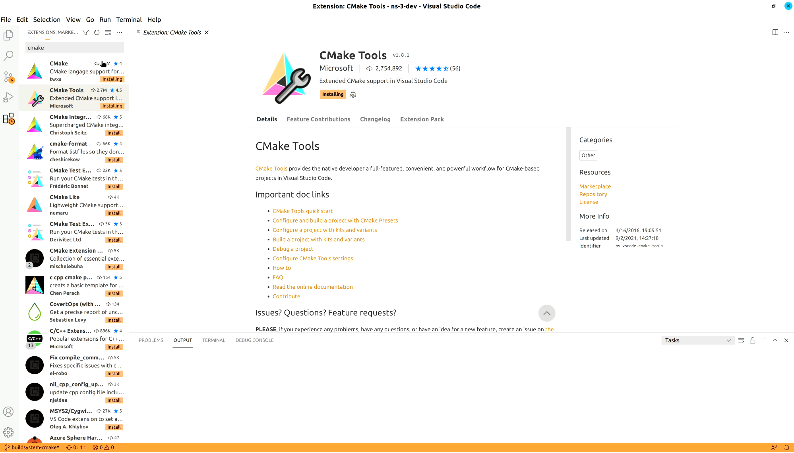

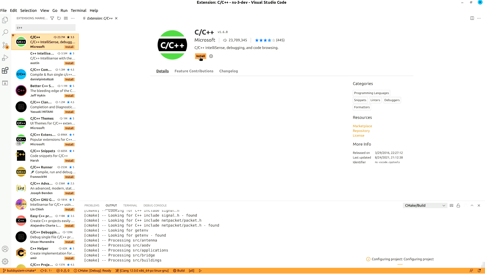

It will take a while, but it will locate the available toolchains for you to use.

After that, open the ns-3-dev folder. It should run CMake automatically and preconfigure it.

.. figure:: ../figures/vscode/open_project.png

After this happens, you can choose ns-3 features by opening the CMake cache and toggling them on or off.

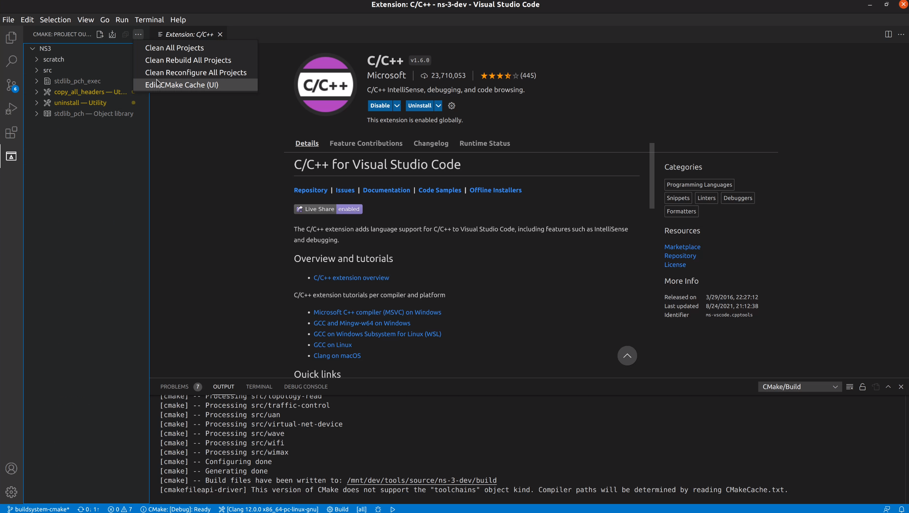

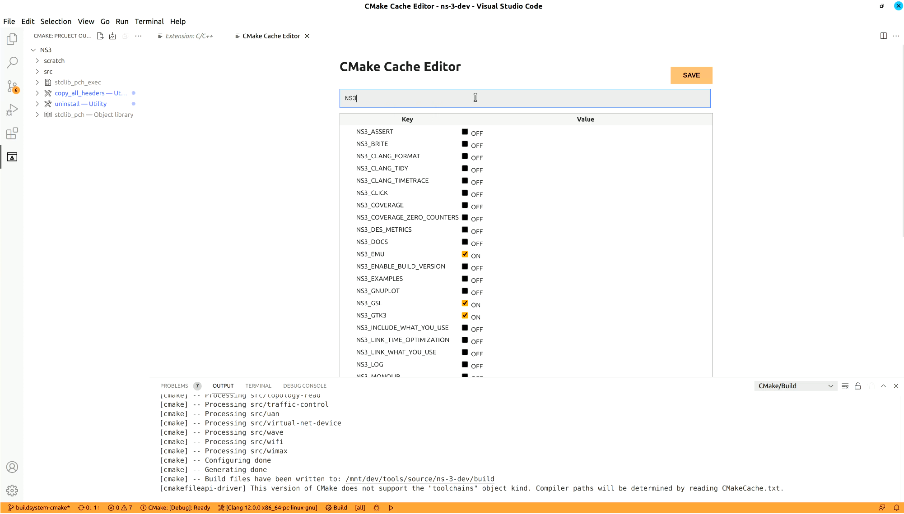

Just as an example, here is how to enable examples

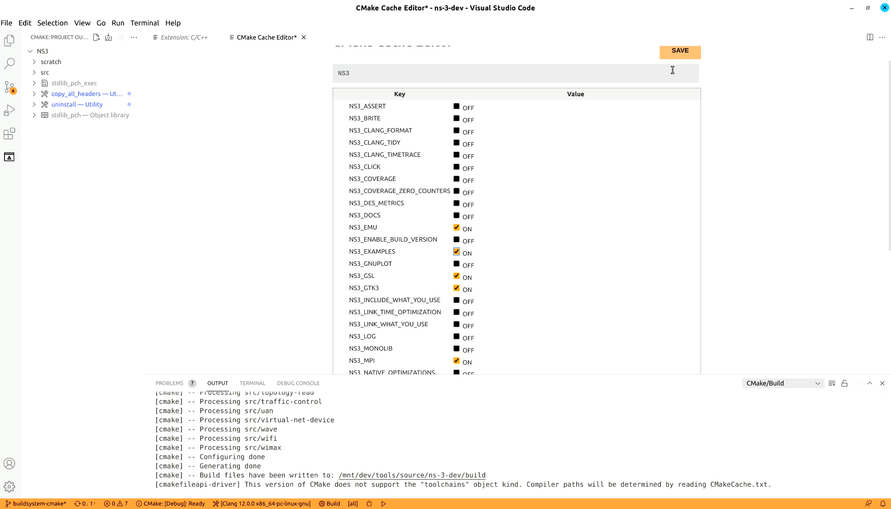

After saving the cache, CMake will run, refreshing the cache. Then VsCode will update its
list of targets on the left side of the screen in the CMake menu.

After selecting a target on the left side menu, there are options to build, run or debug it.

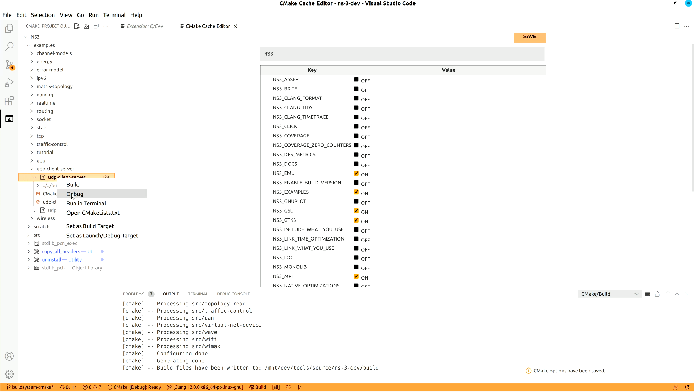

Any of them will automatically build the selected target.
If you choose run or debug, the executable targets will be executed.
You can open the source files you want, put some breakpoints and then click debug to visually debug programs.

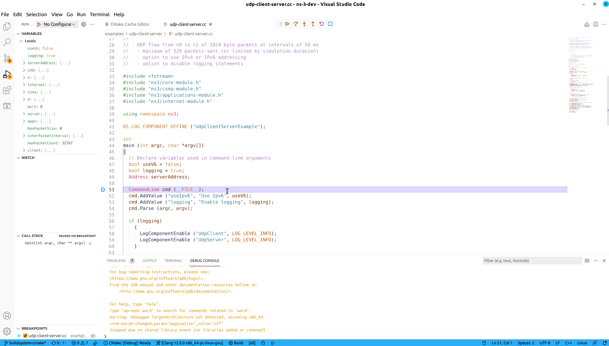

Note: If you are running on Windows, you need to manually add your ns-3 library directory
to the ``PATH`` environment variable. This can be accomplished in two ways.

The first, is to set VSCode's ``settings.json`` file to include the following:

.. sourcecode:: json

  "cmake.environment": {
        "PATH": "${env:PATH};${workspaceFolder}/build/lib"
    }

The second, a more permanent solution, with the following command:

.. sourcecode:: console

  > echo %PATH%
  C:\Windows\System32\WindowsPowerShell\v1.0\;C:\Windows\system32;C:\Windows;C:\Windows\System32\Wbem;
  C:\Windows\System32\OpenSSH\;C:\Program Files\dotnet\;C:\Program Files\PuTTY\;C:\Program Files\VSCodium\bin;
  C:\Program Files\Meld\;C:\Windows\System32\WindowsPowerShell\v1.0\;C:\Windows\system32;C:\Windows;
  C:\Windows\System32\Wbem;C:\Windows\System32\OpenSSH\;C:\Program Files\dotnet\;C:\Program Files\PuTTY\;
  C:\Program Files\VSCodium\bin;C:\Program Files\Meld\;C:\Users\username\AppData\Local\Microsoft\WindowsApps;

  > setx PATH "%PATH%;C:\path\to\ns-3-dev\build\lib"

  SUCCESS: Specified value was saved.

  > echo %PATH%
  C:\Windows\System32\WindowsPowerShell\v1.0\;C:\Windows\system32;C:\Windows;C:\Windows\System32\Wbem;
  ...
  C:\Program Files\VSCodium\bin;C:\Program Files\Meld\;C:\Users\username\AppData\Local\Microsoft\WindowsApps;
  C:\tools\source\ns-3-dev\build\lib;

If you do not setup your ``PATH`` environment variable, you may end up having problems to debug that
look like the following:

.. sourcecode:: console

  =thread-group-added,id="i1"
  GNU gdb (GDB) 14.1
  Copyright (C) 2023 Free Software Foundation, Inc.
  License GPLv3+: GNU GPL version 3 or later <http://gnu.org/licenses/gpl.html>
  ...
  ERROR: Unable to start debugging. GDB exited unexpectedly.
  The program 'C:\tools\source\ns-3-dev\build\examples\wireless\ns3-dev-wifi-he-network-debug.exe' has exited with code 0 (0x00000000).

  ERROR: During startup program exited with code 0xc0000135.

Or

.. sourcecode:: console

  =thread-group-added,id="i1"
  GNU gdb (GDB) 14.1
  Copyright (C) 2023 Free Software Foundation, Inc.
  License GPLv3+: GNU GPL version 3 or later <http://gnu.org/licenses/gpl.html>
  ...
  ERROR: Unable to start debugging. Unexpected GDB output from command "-exec-run". During startup program exited with code 0xc0000135.
  The program 'C:\tools\source\ns-3-dev\build\examples\wireless\ns3-dev-wifi-he-network-debug.exe' has exited with code 0 (0x00000000).

JetBrains CLion
===============

Start by downloading `CLion <https://www.jetbrains.com/clion/>`_.

The following image contains the toolchain configuration window for
CLion running on Windows (only WSLv2 is currently supported).

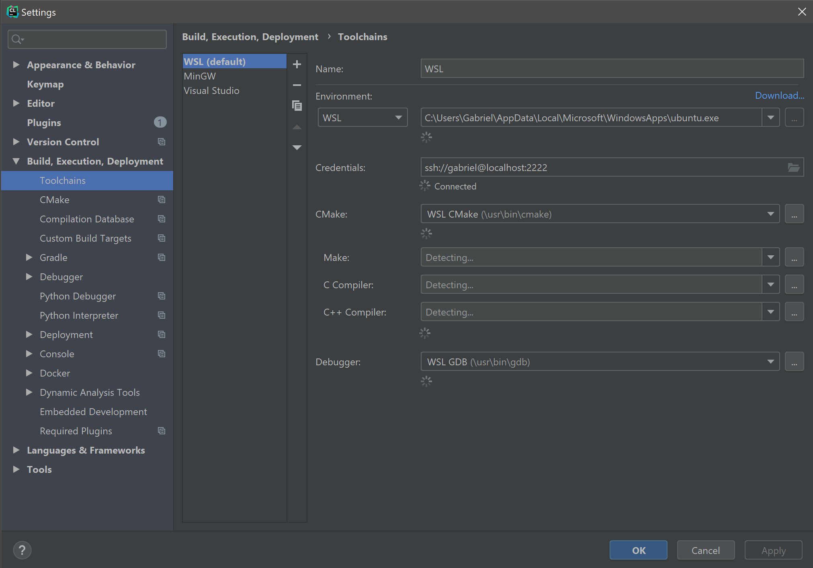

CLion uses Makefiles for your platform as the default generator.
Here you can choose a better generator like `ninja` by setting the cmake options flag to `-G Ninja`.
You can also set options to enable examples (`-DNS3_EXAMPLES=ON`) and tests (`-DNS3_TESTS=ON`).

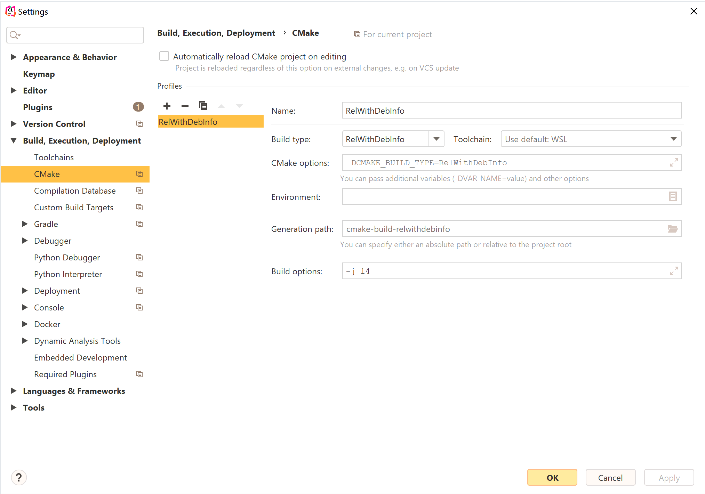

To refresh the CMake cache, triggering the discovery of new targets (libraries, executables and/or modules),
you can either configure to re-run CMake automatically after editing CMake files (pretty slow and easily
triggered) or reload it manually. The following image shows how to trigger the CMake cache refresh.

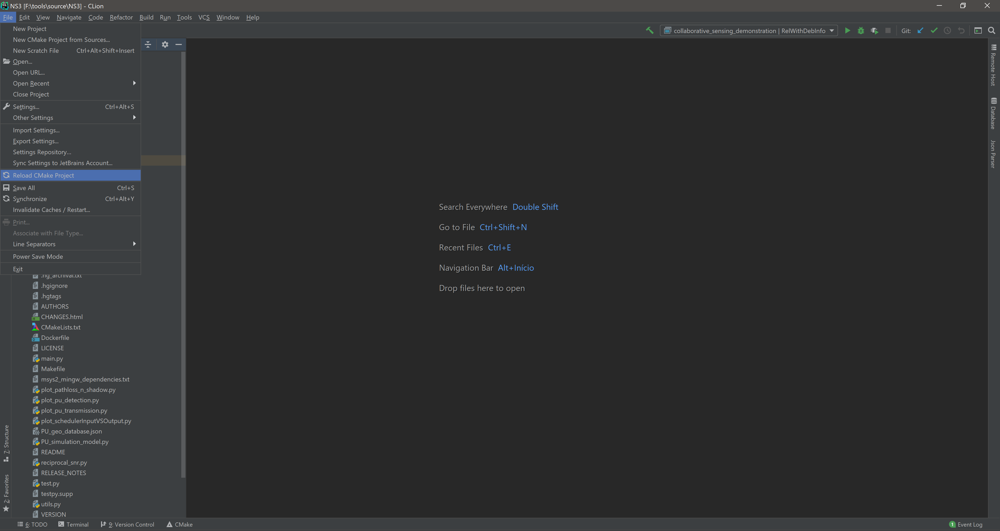

After configuring the project, the available targets are listed in a drop-down list on the top right corner.
Select the target you want and then click the hammer symbol to build, as shown in the image below.

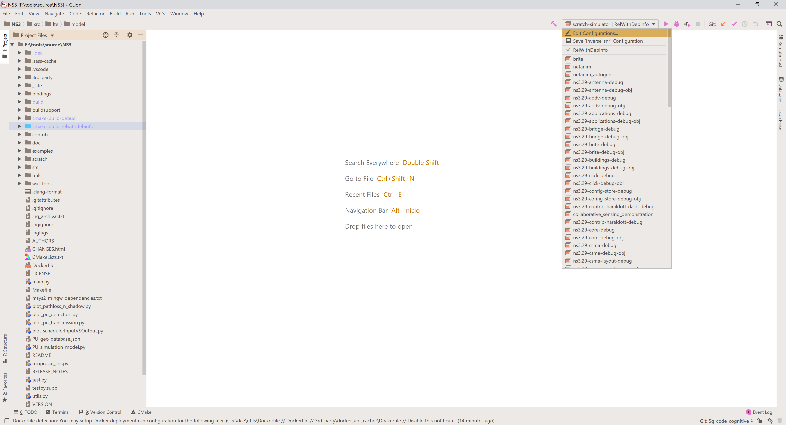

If you have selected and executable target, you can click either the play button to execute the program;
the bug to debug the program; the play button with a chip, to run Valgrind and analyze memory usage,
leaks and so on.

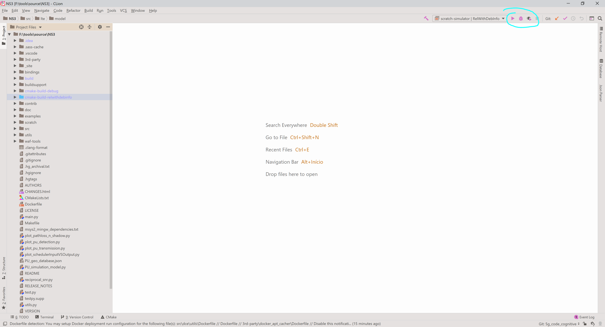

Code::Blocks
============

Start by installing `Code::Blocks <https://www.codeblocks.org/>`_.

Code::Blocks does not support CMake project natively, but we can use the corresponding CMake
generator to generate a project in order to use it. The generator name depends on the operating
system and underlying build system. https://cmake.org/cmake/help/latest/generator/CodeBlocks.html

.. sourcecode:: console

  $ ./ns3 configure -G"CodeBlocks - Ninja" --enable-examples

  ...

  $ -- Build files have been written to: /ns-3-dev/cmake-cache

There will be a NS3.cbp file inside the cache folder used during configuration (in this case cmake-cache).
This is a Code::Blocks project file that can be opened by the IDE.

When you first open the IDE, you will be greeted by a window asking you to select the compiler you want.

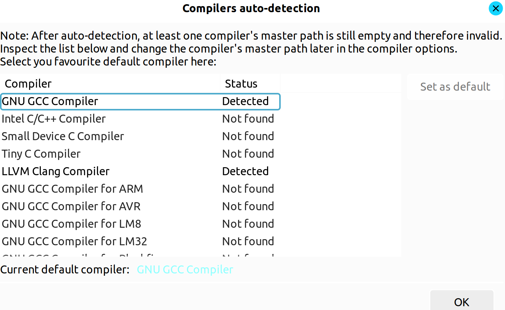

After that you will get into the landing page where you can open the project.

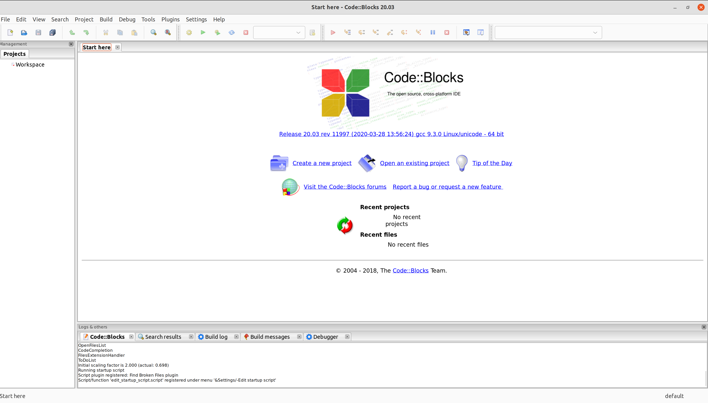

Loading it will take a while.

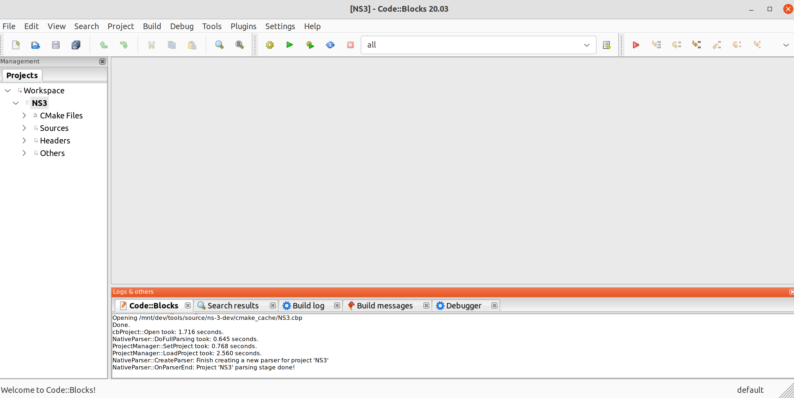

After that we can select a target in the top menu (where it says "all") and click to build, run or debug.
We can also set breakpoints on the source code.

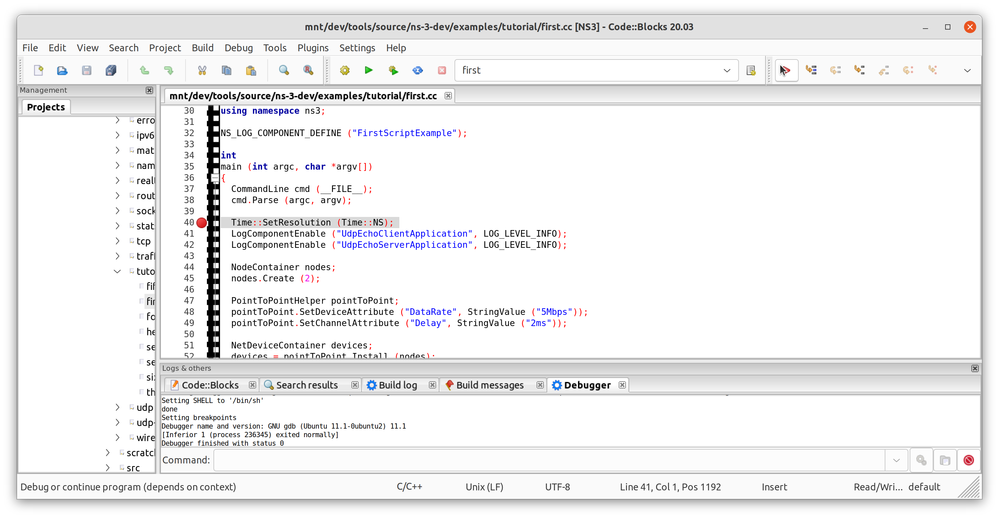

After clicking to build, the build commands of the underlying build system will be printed in the tab at the bottom.
If you clicked to debug, the program will start automatically and stop at the first breakpoint.

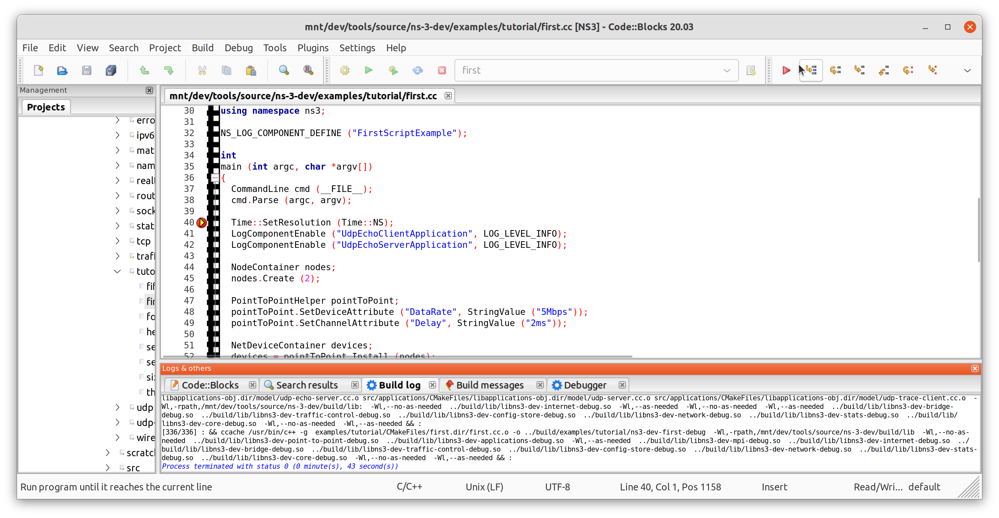

You can inspect memory and the current stack enabling those views in Debug->Debugging Windows->Watches and Call Stack.
Using the debugging buttons, you can advance line by line, continue until the next breakpoint.

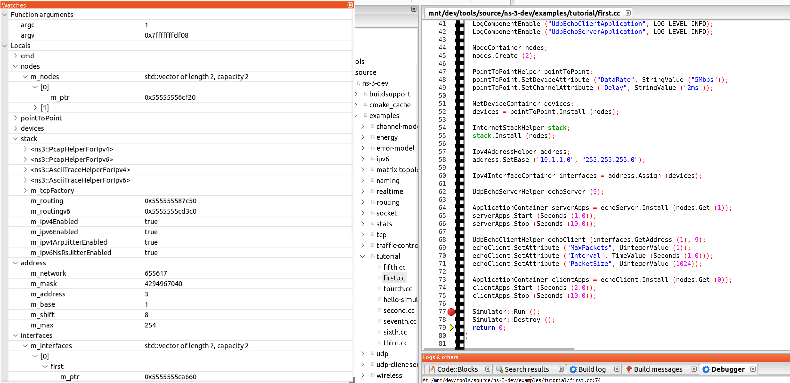

Note: as Code::Blocks doesn't natively support CMake projects, it doesn't refresh the CMake cache, which means you
will need to close the project, run the ``./ns3`` command to refresh the CMake caches after adding/removing
source files to/from the CMakeLists.txt files, adding a new module or dependencies between modules.

Apple XCode
============

Start by installing `XCode <https://developer.apple.com/xcode/>`_.
Then open it for the first time and accept the license.
Then open Xcode->Preferences->Locations and select the command-line tools location.

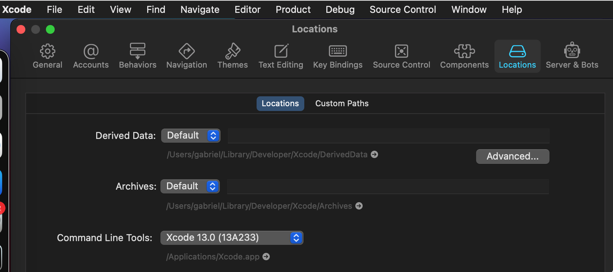

XCode does not support CMake project natively, but we can use the corresponding CMake
generator to generate a project in order to use it. The generator name depends on the operating
system and underlying build system. https://cmake.org/cmake/help/latest/generator/Xcode.html

.. sourcecode:: console

  $ ./ns3 configure -GXcode --enable-examples

  ...

  $ -- Build files have been written to: /ns-3-dev/cmake-cache

There will be a NS3.xcodeproj file inside the cache folder used during configuration
(in this case cmake-cache). This is a XCode project file that can be opened by the IDE.

Loading the project will take a while, and you will be greeted with the following prompt.
Select to automatically create the schemes.

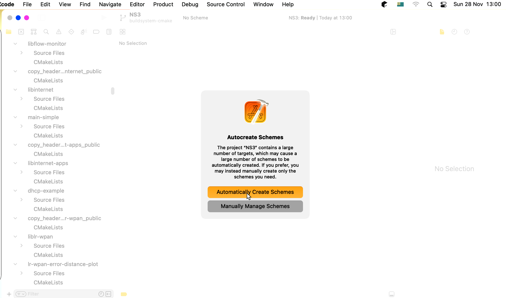

After that we can select a target in the top menu and click to run, which will build and run
(if executable, or debug if build with debugging symbols).

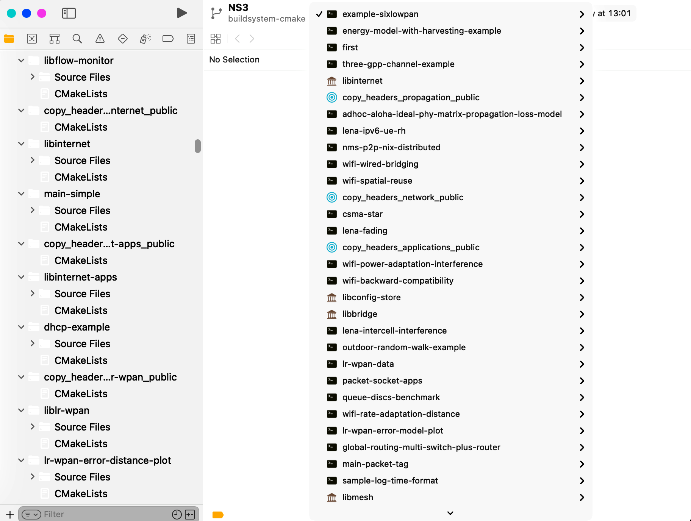

After clicking to build, the build will start and progress is shown in the top bar.

Before debugging starts, Xcode will request for permissions to attach to the process
(as an attacker could pretend to be a debugging tool and steal data from other processes).

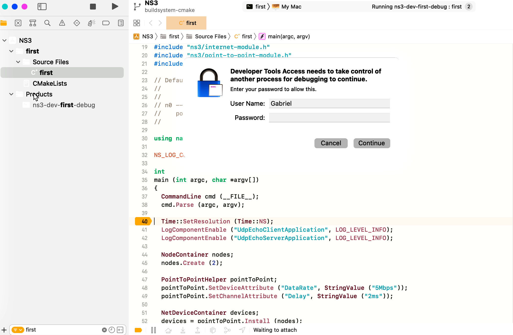

After attaching, we are greeted with profiling information and call stack on the left panel,
source code, breakpoint and warnings on the central panel. At the bottom there are the memory
watches panel in the left and the output panel on the right, which is also used to read the command line.

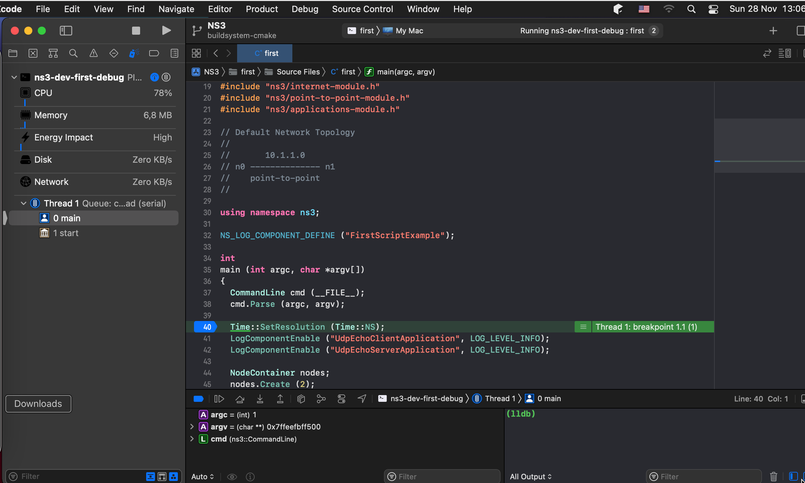

Note: as XCode doesn't natively support CMake projects, it doesn't refresh the CMake cache, which means you
will need to close the project, run the ``./ns3`` command to refresh the CMake caches after adding/removing
source files to/from the CMakeLists.txt files, adding a new module or dependencies between modules.

Testing ns-3
************

You can run the unit tests of the |ns3| distribution by running the
``./test.py`` script:

.. sourcecode:: console

  $ ./test.py --no-build

These tests are run in parallel by ns3. You should eventually
see a report saying that

.. sourcecode:: text

  92 of 92 tests passed (92 passed, 0 failed, 0 crashed, 0 valgrind errors)

This is the important message to check for; failures, crashes, or valgrind
errors indicate problems with the code or incompatibilities between the
tools and the code.

You will also see the summary output from ns3 and the test runner
executing each test, which will actually look something like:

.. sourcecode:: console

  -- CCache is enabled
  -- The CXX compiler identification is GNU 11.2.0
  -- The C compiler identification is GNU 11.2.0

  ...

  -- Configuring done
  -- Generating done
  -- Build files have been written to: /ns-3-dev/cmake-cache

  ...
  Scanning dependencies of target tap-creator
  [  1%] Building CXX object src/fd-net-device/CMakeFiles/tap-device-creator.dir/helper/tap-device-creator.cc.o
  [  1%] Building CXX object src/tap-bridge/CMakeFiles/tap-creator.dir/model/tap-creator.cc.o
  [  1%] Building CXX object src/fd-net-device/CMakeFiles/raw-sock-creator.dir/helper/creator-utils.cc.o
  [  1%] Building CXX object src/tap-bridge/CMakeFiles/tap-creator.dir/model/tap-encode-decode.cc.o
  [  1%] Linking CXX executable ../../../build/src/fd-net-device/ns3-dev-tap-device-creator

   ...

  [100%] Linking CXX executable ../../../build/examples/matrix-topology/ns3-dev-matrix-topology
  [100%] Built target manet-routing-compare
  [100%] Built target matrix-topology
  [1/742] PASS: TestSuite aodv-routing-id-cache
  [2/742] PASS: TestSuite routing-aodv
  [3/742] PASS: TestSuite uniform-planar-array-test
  [4/742] PASS: TestSuite angles

  ...

  [740/742] PASS: Example src/wifi/examples/wifi-manager-example --wifiManager=MinstrelHt --standard=802.11ax-6GHz --serverChannelWidth=160 --clientChannelWidth=160 --serverShortGuardInterval=3200 --clientShortGuardInterval=3200 --serverNss=4 --clientNss=4 --stepTime=0.1
  [741/742] PASS: Example src/lte/examples/lena-radio-link-failure --numberOfEnbs=2 --useIdealRrc=0 --interSiteDistance=700 --simTime=17
  [742/742] PASS: Example src/lte/examples/lena-radio-link-failure --numberOfEnbs=2 --interSiteDistance=700 --simTime=17
  739 of 742 tests passed (739 passed, 3 skipped, 0 failed, 0 crashed, 0 valgrind errors)

This command is typically run by users to quickly verify that an
|ns3| distribution has built correctly.  (Note the order of the ``PASS: ...``
lines can vary, which is okay.  What's important is that the summary line at
the end report that all tests passed; none failed or crashed.)

Both ns3 and ``test.py`` will split up the job on the available CPU cores
of the machine, in parallel.

Running a Script
****************

We typically run scripts under the control of ns3.  This allows the build
system to ensure that the shared library paths are set correctly and that
the libraries are available at run time.  To run a program, simply use the
``--run`` option in ns3.  Let's run the |ns3| equivalent of the
ubiquitous hello world program by typing the following:

.. sourcecode:: console

  $ ./ns3 run hello-simulator

ns3 first checks to make sure that the program is built correctly and
executes a build if required.  ns3 then executes the program, which
produces the following output.

.. sourcecode:: text

  Hello Simulator

Congratulations!  You are now an ns-3 user!

**What do I do if I don't see the output?**

If you see ns3 messages indicating that the build was
completed successfully, but do not see the "Hello Simulator" output,
chances are that you have switched your build mode to ``optimized`` in
the `Building with the ns3 CMake wrapper`_ section, but have missed the change back to
``debug`` mode.  All of the console output used in this tutorial uses a
special |ns3| logging component that is useful for printing
user messages to the console.  Output from this component is
automatically disabled when you compile optimized code -- it is
"optimized out."  If you don't see the "Hello Simulator" output,
type the following:

.. sourcecode:: console

  $ ./ns3 configure --build-profile=debug --enable-examples --enable-tests

to tell ns3 to build the debug versions of the |ns3|
programs that includes the examples and tests.  You must still build
the actual debug version of the code by typing

.. sourcecode:: console

  $ ./ns3

Now, if you run the ``hello-simulator`` program, you should see the
expected output.

Program Arguments
+++++++++++++++++

To feed command line arguments to an |ns3| program use this pattern:

.. sourcecode:: console

  $ ./ns3 run <ns3-program> --command-template="%s <args>"

Substitute your program name for ``<ns3-program>``, and the arguments
for ``<args>``.  The ``--command-template`` argument to ns3 is
basically a recipe for constructing the actual command line ns3 should use
to execute the program.  ns3 checks that the build is complete,
sets the shared library paths, then invokes the executable
using the provided command line template,
inserting the program name for the ``%s`` placeholder.

If you find the above to be syntactically complicated, a simpler variant
exists, which is to include the |ns3| program and its arguments enclosed
by single quotes, such as:

.. sourcecode:: console

  $ ./ns3 run '<ns3-program> --arg1=value1 --arg2=value2 ...'

Another particularly useful example is to run a test suite by itself.
Let's assume that a ``mytest`` test suite exists (it doesn't).
Above, we used the ``./test.py`` script to run a whole slew of
tests in parallel, by repeatedly invoking the real testing program,
``test-runner``.  To invoke ``test-runner`` directly for a single test:

.. sourcecode:: console

  $ ./ns3 run test-runner --command-template="%s --suite=mytest --verbose"

This passes the arguments to the ``test-runner`` program.
Since ``mytest`` does not exist, an error message will be generated.
To print the available ``test-runner`` options:

.. sourcecode:: console

  $ ./ns3 run test-runner --command-template="%s --help"

Debugging
+++++++++

To run |ns3| programs under the control of another utility, such as
a debugger (*e.g.* ``gdb``) or memory checker (*e.g.* ``valgrind``),
you use a similar ``--command-template="..."`` form.

For example, to run your |ns3| program ``hello-simulator`` with the arguments
``<args>`` under the ``gdb`` debugger:

.. sourcecode:: console

  $ ./ns3 run hello-simulator --command-template="gdb %s --args <args>"

Notice that the |ns3| program name goes with the ``--run`` argument,
and the control utility (here ``gdb``) is the first token
in the ``--command-template`` argument.  The ``--args`` tells ``gdb``
that the remainder of the command line belongs to the "inferior" program.
(Some ``gdb``'s don't understand the ``--args`` feature.  In this case,
omit the program arguments from the ``--command-template``,
and use the ``gdb`` command ``set args``.)

We can combine this recipe and the previous one to run a test under the
debugger:

.. sourcecode:: console

  $ ./ns3 run test-runner --command-template="gdb %s --args --suite=mytest --verbose"

Working Directory
+++++++++++++++++

ns3 needs to run from its location at the top of the |ns3| tree.
This becomes the working directory where output files will be written.
But what if you want to keep those files out of the |ns3| source tree?  Use
the ``--cwd`` argument:

.. sourcecode:: console

  $ ./ns3 run program-name --cwd=...

We mention this ``--cwd`` command for completeness; most users will simply
run ns3 from the top-level directory and generate the output data files there.

Running without Building
++++++++++++++++++++++++

As of the ns-3.30 release, a new ns3 option was introduced to allow the
running of programs while skipping the build step.  This can reduce the time
to run programs when, for example, running the same program repeatedly
through a shell script, or when demonstrating program execution.
The option ``--no-build`` modifies the ``run`` option,
skipping the build steps of the program and required ns-3 libraries.

.. sourcecode:: console

  $ ./ns3 run '<ns3-program> --arg1=value1 --arg2=value2 ...' --no-build

Build version
+++++++++++++

As of the ns-3.32 release, a new ns3 configure option ``--enable-build-version``
was introduced which inspects the local ns3 git repository during builds and adds
version metadata to the core module.

This configuration option has the following prerequisites:

- The ns-3 directory must be part of a local git repository
- The local git repository must have at least one ns-3 release tag

or

- A file named version.cache, containing version information, is located in the
  src/core directory

If these prerequisites are not met, the configuration will fail.

When these prerequisites are met and ns-3 is configured with the
``--enable-build-version`` option, the ns3 command ``show version`` can be
used to query the local git repository and display the current version metadata.

.. sourcecode:: console

  $ ./ns3 show version

ns3 will collect information about the build and print out something similar
to the output below.

.. sourcecode:: text

  ns-3.33+249@g80e0dd0-dirty-debug

If ``show version`` is run when ``--enable-build-version`` was not configured,
an error message indicating that the option is disabled will be displayed instead.

.. sourcecode:: text

  Build version support is not enabled, reconfigure with --enable-build-version flag

The build information is generated by examining the current state of the git
repository.  The output of  ``show version`` will change whenever the state
of the active branch changes.

The output of ``show version`` has the following format:

.. sourcecode:: text

  <version_tag>[+closest_tag][+distance_from_tag]@<commit_hash>[-tree_state]-<profile>

version_tag
  version_tag contains the version of the ns-3 code.  The version tag is
  defined as a git tag with the format ns-3*.  If multiple git tags match the
  format, the tag on the active branch which is closest to the current commit
  is chosen.

closest_tag
  closest_tag is similar to version_tag except it is the first tag found,
  regardless of format.  The closest tag is not included in the output when
  closest_tag and version_tag have the same value.

distance_from_tag
  distance_from_tag contains the number of commits between the current commit
  and closest_tag.  distance_from_tag is not included in the output when the
  value is 0 (i.e. when closest_tag points to the current commit)

commit_hash
  commit_hash is the hash of the commit at the tip of the active branch. The
  value is 'g' followed by the first 7 characters of the commit hash. The 'g'
  prefix is used to indicate that this is a git hash.

tree_state
  tree_state indicates the state of the working tree.  When the working tree
  has uncommitted changes this field has the value 'dirty'.  The tree state is
  not included in the version output when the working tree is clean (e.g. when
  there are no uncommitted changes).

profile
  The build profile specified in the ``--build-profile`` option passed to
  ``ns3 configure``

A new class, named Version, has been added to the core module.  The Version class
contains functions to retrieve individual fields of the build version as well
as functions to print the full build version like ``show version``.
The ``build-version-example``  application provides an example of how to use
the Version class to retrieve the various build version fields.  See the
documentation for the Version class for specifics on the output of the Version
class functions.

The version information stored in the Version class is updated every time the
git repository changes.  This may lead to frequent recompilations/linking of
the core module when the ``--enable-build-version`` option is configured.

.. sourcecode:: text

  build-version-example:
  Program Version (according to CommandLine): ns-3.33+249@g80e0dd0-dirty-debug

  Version fields:
  LongVersion:        ns-3.33+249@g80e0dd0-dirty-debug
  ShortVersion:       ns-3.33+*
  BuildSummary:       ns-3.33+*
  VersionTag:         ns-3.33
  Major:              3
  Minor:              33
  Patch:              0
  ReleaseCandidate:
  ClosestAncestorTag: ns-3.33
  TagDistance:        249
  CommitHash:         g80e0dd0
  BuildProfile:       debug
  WorkingTree:        dirty

The CommandLine class has also been updated to support the ``--version``
option which will print the full build version and exit.

.. sourcecode:: text

  ./ns3 run "command-line-example --version" --no-build
  ns-3.33+249@g80e0dd0-dirty-debug

If the ``--enable-build-version`` option was not configured, ``--version``
will print out a message similar to ``show version`` indicating that the build
version option is not enabled.

Source version
++++++++++++++

An alternative to storing build version information in the |ns3| libraries
is to track the source code version used to build the code.  When using
Git, the following recipe can be added to Bash shell scripts to
create a ``version.txt`` file with Git revision information, appended
with a patch of any changes to that revision if the repository is dirty.
The resulting text file can then be saved with any corresponding
|ns3| simulation results.

.. sourcecode:: console

  echo `git describe` > version.txt
  gitDiff=`git diff`
  if [[ $gitDiff ]]
  then
      echo "$gitDiff" >> version.txt
  fi
