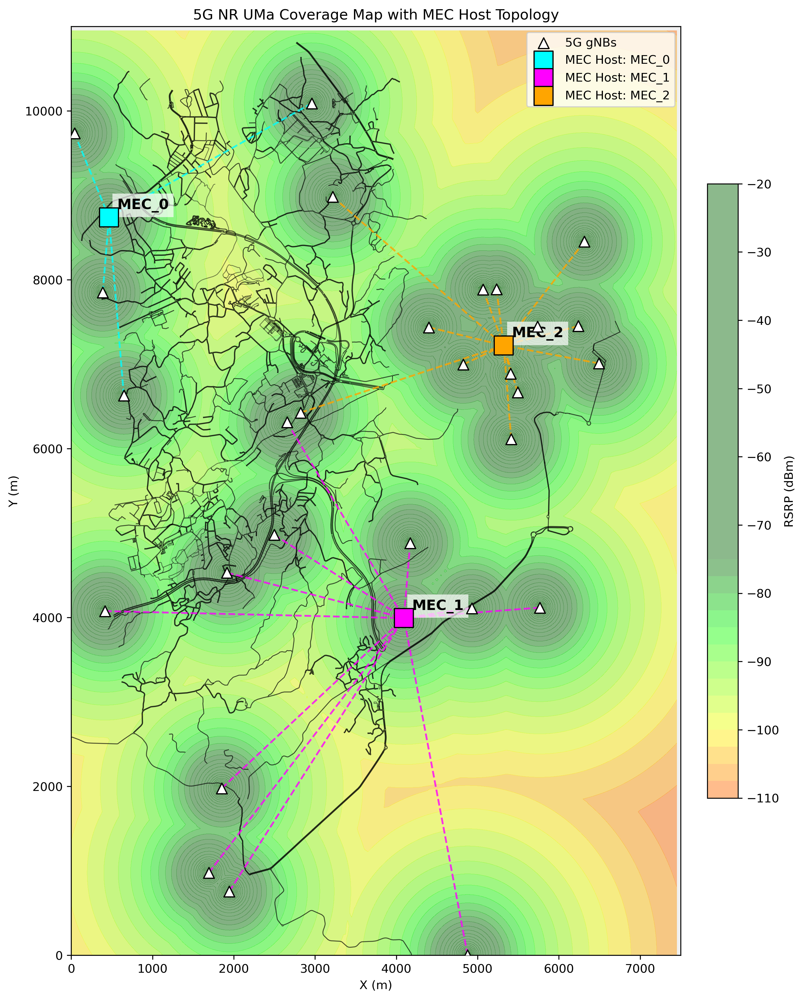

# 5G NR UMa Coverage Map (Guimarães)

Here is the projected 5G NR signal coverage map across the Guimarães scenario, generated using the **3GPP TR 38.901 UMa (Urban Macro) Non-Line of Sight** propagation model configured in your simulation parameters (3.5 GHz n78 band). 

### Map Details:
* **Background:** The SUMO road network directly parsed from `guimaraes.net.xml`. 
* **Base Stations (gNBs):** The 31 NOS logical LTE/5G sites, plotted as white triangles.
* **MEC Hosts (Optimized):** The 3 edge servers (`MEC_0`, `MEC_1`, `MEC_2`) have been automatically positioned using a **K-Means clustering algorithm** to find the absolute center of mass (centroid) for each region of the city.
* **Routing Topology:** Dashed lines connect each gNB to its primary MEC Host. Because of the K-Means optimization, the network load and physical distances are now perfectly balanced across the 3 servers.
* **Signal Quality (RSRP):** The heatmap opacity has been lowered to `45%` to clearly see the streets below.
  * **Dark Green:** > -80 dBm (Excellent coverage)
  * **Yellow:** ~ -100 dBm (Good/Acceptable)
  * **Red/Dark Red:** < -115 dBm (Poor coverage / Cell edge)
