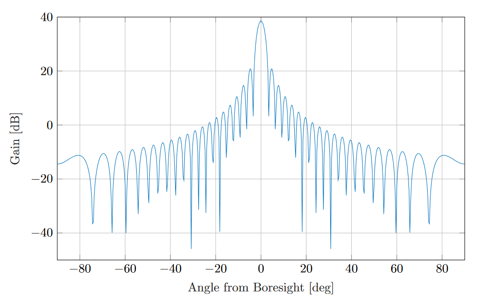

.. include:: replace.txt
.. highlight:: cpp
.. highlight:: bash

Antenna
=======

The Antenna module provides:

- A class ``Angles`` and utility functions to deal with angles.
- A base class ``AntennaModel`` that provides an interface for the modeling of the radiation pattern of an antenna with a set of classes derived from this base class, each models the radiation pattern of different types of antennas.
- A base class ``PhasedArrayModel`` that provides a flexible interface for modeling a number of Phase Antenna Array (PAA) models.
- A class ``UniformPlanarArray`` derived from this base class, implementing a Uniform Planar Array (UPA) supporting both rectangular and linear lattices.

 The antenna model can be used with all the wireless technologies and physical layer models that support it.
 Currently, this includes the physical layer models based on the ``SpectrumPhy`` class. Please refer to the documentation of each of these models for details.

Scope and Limitations
---------------------

Not present.

Angles
------

The Angles class holds information about an angle in 3D space using spherical coordinates in radian units.
Specifically, it uses the azimuth-inclination convention, where

* Inclination is the angle between the zenith direction (positive z-axis) and the desired direction. It is included in the range [0, pi] radians.
* Azimuth is the signed angle measured from the positive x-axis, where a positive direction goes towards the positive y-axis. It is included in the range [-pi, pi) radians.

Multiple constructors are present, supporting the most common ways to encode information on a direction.
A static boolean variable allows the user to decide whether angles should be printed in radian or degree units.

A number of angle-related utilities are offered, such as radians/degree conversions, for both scalars and vectors, and angle wrapping.

AntennaModel
------------

The AntennaModel uses the coordinate system adopted in [:ref:`1<antennaRef1>`] and
depicted in Figure :ref:`fig-antenna-coordinate-system`. This system
is obtained by translating the Cartesian coordinate system used by the
ns-3 MobilityModel into the new origin :math:`o` which is the location
of the antenna, and then transforming the coordinates of every generic
point :math:`p` of the space from Cartesian coordinates
:math:`(x,y,z)` into spherical coordinates
:math:`(r, \theta,\phi)`.

The antenna model neglects the radial component :math:`r`, and
only considers the angle components :math:`(\theta, \phi)`. An antenna
radiation pattern is then expressed as a mathematical function
:math:`g(\theta, \phi) \longrightarrow \mathcal{R}` that returns the
gain (in dB) for each possible direction of
transmission/reception. All angles are expressed in radians.

.. _fig-antenna-coordinate-system:

.. figure:: figures/antenna-coordinate-system.*
   :align: center

   Coordinate system of the AntennaModel

The ``AntennaModel`` is used to implement a subset of derived classes that represents different radiation patterns of a single antenna.

The current models supported are:

- Isotropic Antenna Model
- Cosine Antenna Model
- Parabolic Antenna Model
- Three Gpp Antenna Model

**Isotropic Antenna Model**

This is the simplest antenna model. This antenna radiation pattern model provides the same gain (0 dB) for all directions.
This is implemented in the ``IsotropicAntennaModel`` class.

**Cosine Antenna Model**

This is the cosine model described in [:ref:`2<antennaRef2>`]: the antenna gain is
determined as:

.. math::

  g(\phi, \theta) = \cos^{n} \left(\frac{\phi - \phi_{0}}{2}  \right)

where :math:`\phi_{0}` is the azimuthal orientation of the antenna
(i.e., its direction of maximum gain) and the exponential

.. math::

  n = -\frac{3}{20 \log_{10} \left( \cos \frac{\phi_{3dB}}{4} \right)}

determines the desired 3dB beamwidth :math:`\phi_{3dB}`. Note that
this radiation pattern is independent of the inclination angle
:math:`\theta`.

A major difference between the model of [:ref:`2<antennaRef2>`] and the one
implemented in the class CosineAntennaModel is that only the element
factor (i.e., what described by the above formulas) is considered. In
fact, [:ref:`2<antennaRef2>`] also considered an additional antenna array
factor. The reason why the latter is excluded is that we expect that
the average user would desire to specify a given beamwidth exactly,
without adding an array factor at a latter stage which would in
practice alter the effective beamwidth of the resulting radiation
pattern.

This is implemented in the ``CosineAntennaModel`` class.

.. _ParabolicAntennaModel:

**Parabolic Antenna Model**

This model is based on the parabolic approximation of the main lobe radiation pattern. It is often
used in the context of cellular system to model the radiation pattern of a cell sector, see for
instance [:ref:`3<antennaRef3>`] and [:ref:`4<antennaRef4>`]. The antenna gain in dB is determined as:

.. math::

  g_{dB}(\phi, \theta) = -\min \left( 12 \left(\frac{\phi  - \phi_{0}}{\phi_{3dB}} \right)^2, A_{max} \right)

where :math:`\phi_{0}` is the azimuthal orientation of the antenna
(i.e., its direction of maximum gain), :math:`\phi_{3dB}` is its 3 dB
beamwidth, and :math:`A_{max}` is the maximum attenuation in dB of the
antenna. Note that this radiation pattern is independent of the inclination angle
:math:`\theta`.

This is implemented in the ``ParabolicAntennaModel`` class.

**Three Gpp Antenna Model**

This model implements the antenna element described in [:ref:`5<antennaRef5>`].
Parameters are fixed from the technical report, thus no attributes nor setters are provided.
The model is largely based on the :ref:`Parabolic Antenna Model<ParabolicAntennaModel>`.

Phased Array Model
------------------

The class ``PhasedArrayModel`` has been created with flexibility in mind.
It abstracts the basic idea of a Phased Antenna Array (PAA) by removing any constraint on the
position of each element, and instead generalizes the concept of steering and beamforming vectors,
solely based on the generalized location of the antenna elements.
For details on Phased Array Antennas see for instance [:ref:`6<antennaRef6>`].

Derived classes must implement the following functions:

* ``GetNumElems``: returns the number of antenna elements
* ``GetElementLocation``: returns the location of the antenna element with the specified index, normalized with respect to the wavelength
* ``GetElementFieldPattern``: returns the horizontal and vertical components of the antenna element field pattern at the specified direction. Same polarization (configurable) for all antenna elements of the array is considered.

The class ``PhasedArrayModel`` also assumes that all antenna elements are equal, a typical key assumption which allows to model the PAA field pattern as the sum of the array factor, given by the geometry of the location of the antenna elements, and the element field pattern.
Any class derived from ``AntennaModel`` is a valid antenna element for the ``PhasedArrayModel``, allowing for a great flexibility of the framework.

.. _3gpp-antenna-model:

Uniform Planar Array (UPA)
~~~~~~~~~~~~~~~~~~~~~~~~~~

The class UniformPlanarArray is a generic implementation of Uniform Planar Arrays (UPAs),
supporting rectangular and linear regular lattices.
It closely follows the implementation described in the 3GPP TR 38.901 [:ref:`7<antennaRef7>`],
considering only a single panel, i.e., :math:`N_{g} = M_{g} = 1`.

By default, the antenna array is orthogonal to the x-axis, pointing towards the positive
direction, but the orientation can be changed through the attributes ``BearingAngle``,
which adjusts the azimuth angle, and ``DowntiltAngle``, which adjusts the elevation angle.
The slant angle is instead fixed and assumed to be 0.

The number of antenna elements in the vertical and horizontal directions can be configured
through the attributes ``NumRows`` and ``NumColumns``, while the spacing between the horizontal
and vertical elements can be configured through the attributes ``AntennaHorizontalSpacing``
and ``AntennaVerticalSpacing``.

UniformPlannarArray supports the concept of antenna ports following the sub-array partition
model for TXRU virtualization, as described in Section 5.2.2 of 3GPP TR 36.897 [:ref:`8<antennaRef8>`].
The number of antenna ports in vertical and horizontal directions can be configured through
the attributes ``NumVerticalPorts`` and ``NumHorizontalPorts``, respectively. For example,
if ``NumRows`` and ``NumColumns`` are configured to 2 and 4, and the number of
``NumVerticalPorts`` and ``NumHorizontalPorts`` to 1 and 2, then the antenna elements belonging
to the first two columns of the antenna array will belong to the first antenna port,
and the third and the fourth columns will belong to the second antenna port. Note that
``NumRows`` and ``NumColumns`` must be a multiple of ``NumVerticalPorts`` and ``NumHorizontalPorts``,
respectively.

Whether the antenna is dual-polarized or not is configured through the attribute
``IsDualPolarized``. In case the antenna array is dual polarized, the total number
of antenna elements is doubled and the two polarizations are overlapped in space.
The polarization slant angle of the antenna elements belonging to the first polarization
are configured through the attribute ``PolSlantAngle``; while the antenna elements of
the second polarization have the polarization slant angle minus 90 degrees,
as described in [:ref:`7<antennaRef7>`] (i.e., :math:`{\zeta}`).

Circular Aperture Antenna Model
~~~~~~~~~~~~~~~~~~~~~~~~~~~~~~~~

The class ``CircularApertureAntennaModel`` implements the radiation pattern described in [:ref:`7<antennaRef7>`].
Specifically, the latter represents parabolic antennas, i.e., antennas which are typically used
for achieving long range communications such as earth-to-satellite links.
The default boresight orientation is parallel to the positive z-axis, and it can be tuned by
using the ``AntennaInclination`` and ``AntennaAzimuth`` parameters.
This implementation provides an exact characterization of the antenna field pattern, by leveraging
the standard library Bessel functions implementation introduced with C++17.
Accordingly, the antenna gain :math:`G` at an angle :math:`\theta` from the boresight main beam
is evaluated as:

.. math::
   G \cdot 4\left | \frac{J_{1}\left ( k\cdot a\cdot sin\theta \right )}{k\cdot a\cdot sin\theta} \right
   |^{2}\;\;\;\;\; for\; 0<\left | \theta \right |\leq 90^{\circ} \\
   G \cdot 1\;\;\;\;\;\;\;\;\;\;\;\;\;\;\;\;\;\;\;\;\;\;\;\;\;\;\;\;\; for\; \theta=0

where :math:`J_{1}()` is the Bessel function of the first kind and first order, and :math:`a` is
the radius of the antenna's circular aperture.
The parameter :math:`k` is equal to :math:`k=\frac{2\pi f}{x}`, where :math:`f` is the carrier
frequency, and :math:`c` is the speed of light in vacuum.
The parameters :math:`G` (in logarithmic scale), :math:`a` and :math:`f` can be configured by using
the attributes ``AntennaMaxGainDb``, ``AntennaCircularApertureRadius`` and ``OperatingFrequency``, respectively.
This type of antennas features a symmetric radiation pattern, meaning that a single angle, measured
from the boresight direction, is sufficient to characterize the radiation strength along a given direction.

.. _fig-circular-antenna-pattern:

   Circular aperture antenna radiation pattern with :math:`G =` 38.5 dB and :math:`a =` 10 :math:`\frac{c}{f}.`

Usage
-----

Not present.

Helpers
~~~~~~~

Not present

Attributes
~~~~~~~~~~

Not present.

Traces
~~~~~~

Not present.

Examples and Tests
------------------

In this section we describe the test suites included with the antenna
module that verify its correct functionality.

- ``test-angles.cc``: The unit test suite ``angles`` verifies that the Angles class is
  constructed properly by correct conversion from 3D Cartesian
  coordinates according to the available methods (construction from a
  single vector and from a pair of vectors). For each method, several
  test cases are provided that compare the values :math:`(\phi, \theta)`
  determined by the constructor to known reference values. The test
  passes if for each case the values are equal to the reference up to a
  tolerance of :math:`10^{-10}` which accounts for numerical errors.

- ``test-degree-radians.cc``: The unit test suite ``degrees-radians`` verifies that the methods
  ``DegreesToRadians`` and ``RadiansToDegrees`` work properly by
  comparing with known reference values in a number of test
  cases. Each test case passes if the comparison is equal up to a
  tolerance of :math:`10^{-10}` which accounts for numerical errors.

- ``test-isotropic-antenna.cc``: The unit test suite ``isotropic-antenna-model`` checks that the
  ``IsotropicAntennaModel`` class works properly, i.e., returns always a
  0dB gain regardless of the direction.

- ``test-cosine-antenna.cc``: The unit test suite ``cosine-antenna-model`` checks that the
  ``CosineAntennaModel`` class works properly. Several test cases are
  provided that check for the antenna gain value calculated at different
  directions and for different values of the orientation, the reference
  gain and the beamwidth. The reference gain is calculated by hand. Each
  test case passes if the reference gain in dB is equal to the value returned
  by ``CosineAntennaModel`` within a tolerance of 0.001, which accounts
  for the approximation done for the calculation of the reference
  values.

- ``test-parabolic-antenna.cc``: The unit test suite ``parabolic-antenna-model`` checks that the
  ``ParabolicAntennaModel`` class works properly. Several test cases are
  provided that check for the antenna gain value calculated at different
  directions and for different values of the orientation, the maximum attenuation
  and the beamwidth. The reference gain is calculated by hand. Each
  test case passes if the reference gain in dB is equal to the value returned
  by ``ParabolicAntennaModel`` within a tolerance of 0.001, which accounts
  for the approximation done for the calculation of the reference
  values.

Validation
----------

Validation has been performed as described in each antenna test.

References
----------

.. _antennaRef1:

[1] C.A. Balanis, "Antenna Theory - Analysis and Design",  Wiley, 2nd Ed.

.. _antennaRef2:

[2] Li Chunjian, "Efficient Antenna Patterns for Three-Sector WCDMA Systems", Master of Science Thesis, Chalmers University of Technology, Göteborg, Sweden, 2003.

.. _antennaRef3:

[3] 3GPP TSG RAN WG4 (Radio) Meeting #51, R4-092042, Simulation assumptions and parameters for FDD HeNB RF requirements.

.. _antennaRef4:

[`4 <https://dl.acm.org/doi/abs/10.1145/1234161.1234186>`_] George Calcev and Matt Dillon, "Antenna Tilt Control in CDMA Networks", in Proc. of the 2nd Annual International Wireless Internet Conference (WICON), 2006.

.. _antennaRef5:

[5] 3GPP. 2018. TR 38.901, Study on channel model for frequencies from 0.5 to 100 GHz, V15.0.0. (2018-06).

.. _antennaRef6:

[6] Robert J. Mailloux, "Phased Array Antenna Handbook", Artech House, 2nd Ed.

.. _antennaRef7:

[`7 <https://hscc.csie.ncu.edu.tw/38811.pdf>`_] 3GPP. 2018. TR 38.811, Study on New Radio (NR) to support non-terrestrial networks, V15.4.0. (2020-09).

.. _antennaRef8:

[`8 <https://portal.3gpp.org/desktopmodules/Specifications/SpecificationDetails.aspx?specificationId=2580>`_] 3GPP. 2015. TR 36.897. Study on elevation beamforming / Full-Dimension (FD) Multiple Input Multiple Output (MIMO) for LTE. V13.0.0. (2015-06).

