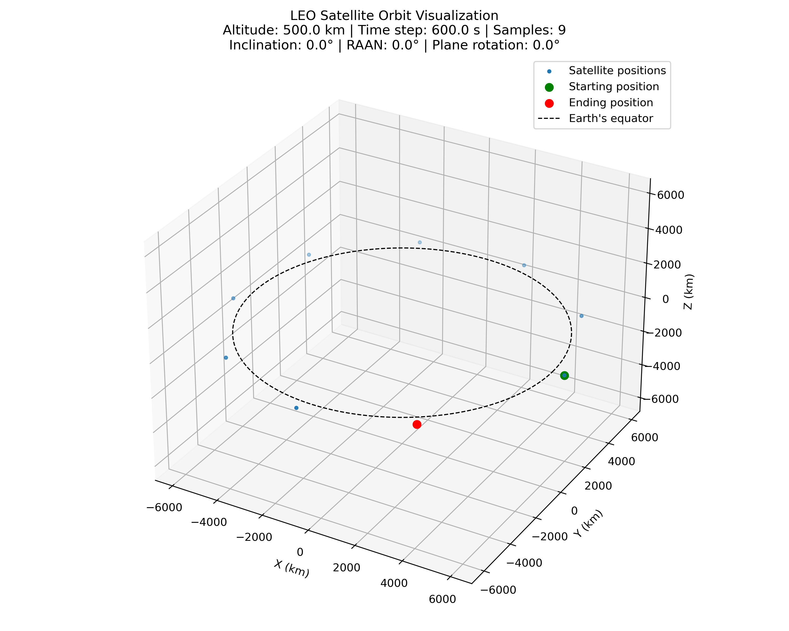
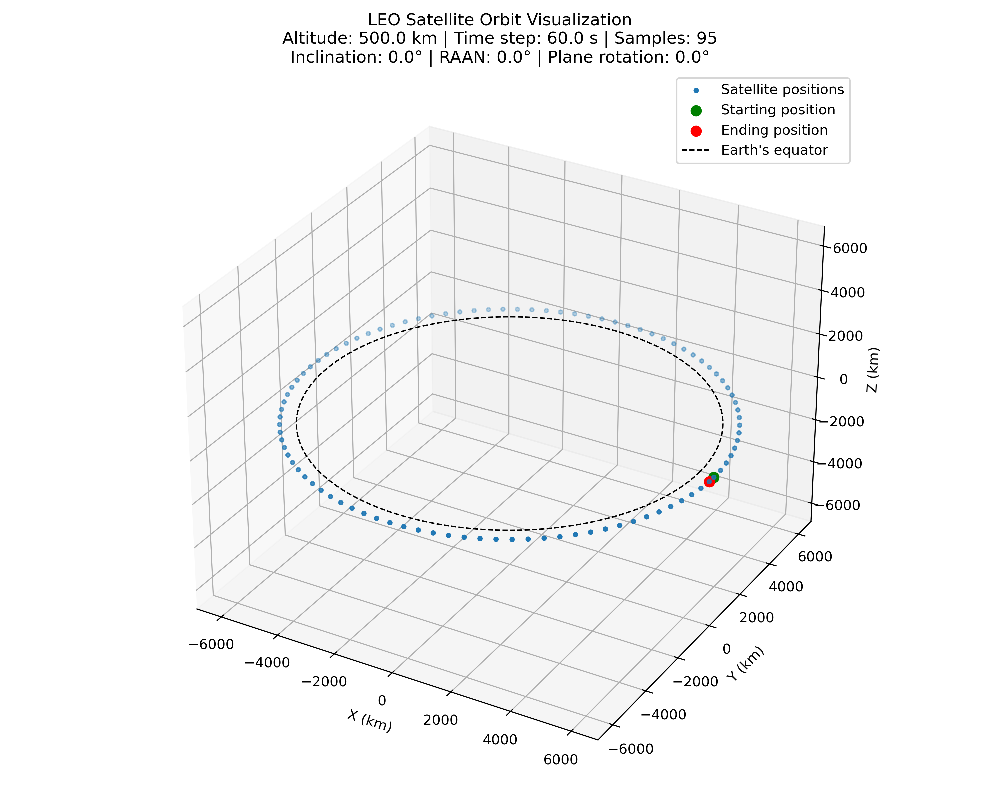
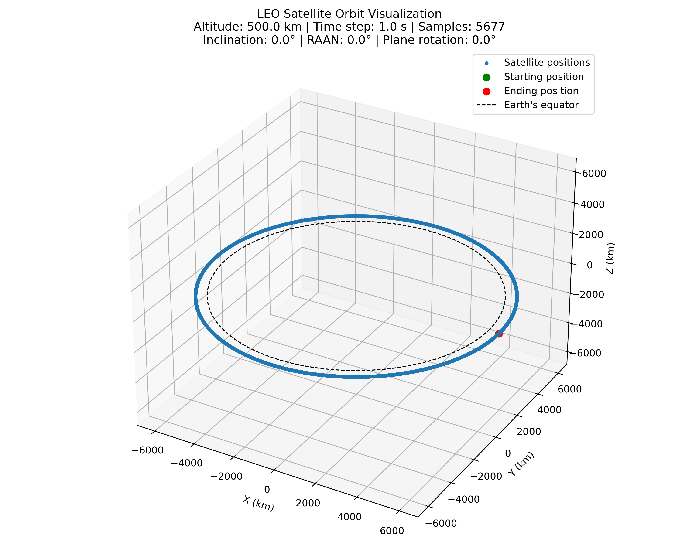
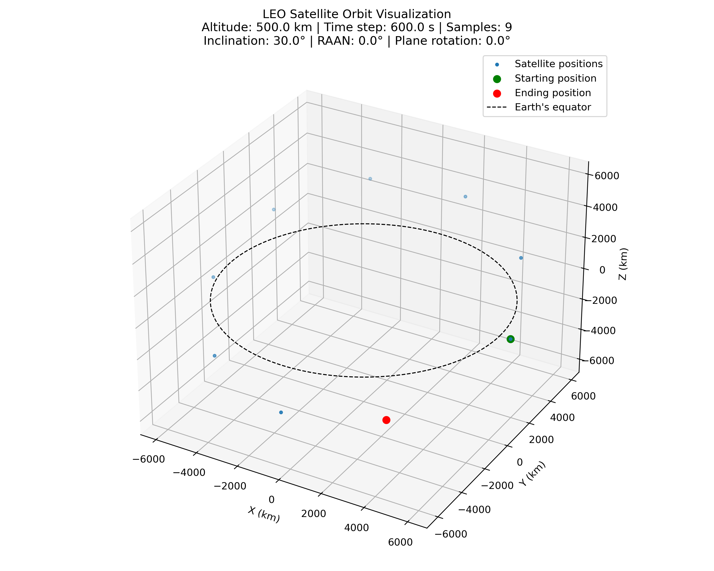
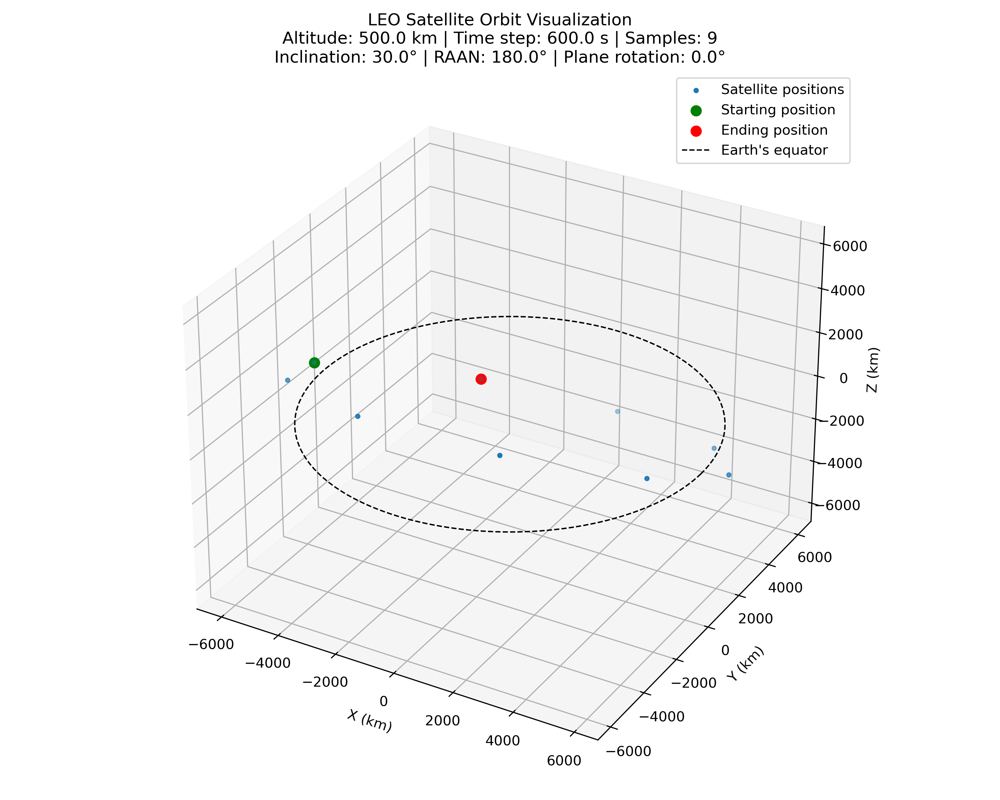
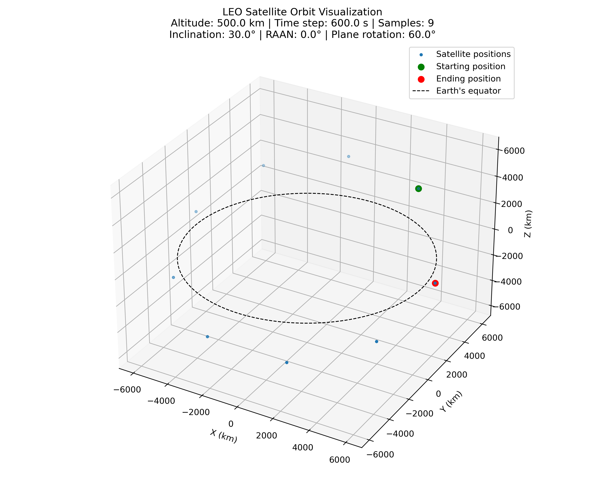

.. include:: replace.txt

.. _orbital-mobility:

Orbital Mobility
----------------

This mobility model was originally developed by Tim Schubert as part of ns-3-leo [:ref:`4<mobilityRef4>`].
It was then ported, refactored and optimized by Thiago Myazaki as part of Google Summer of Code (GSoC) 2025.

It allows for the configuration of satellite scenarios, with the objective to create an example integrating
LEO satellites using beamforming, channel and propagation models from the NR Module and ns-3, leveraging a
helper model to aid the instantiation of LEO satellites.

It models simple circular orbits with constant orbital velocity.

In addition to the mobility model, we have also ported an example from ns-3-leo [:ref:`4<mobilityRef4>`] that outputs position traces
as ECEF coordinates. Using a Python script developed during the project, ``plot-orbital-traces.py``, we produced
animated plots that helped validate the nodes' initial positions and their movement over time, under
different configurations of numbers of nodes, inclination, and altitude.

We also have a unified example (`leo-satellite-example.cc`) that combines three use cases into a single program
controlled by the ``--mode`` switch: ``orbit`` for mobility tracing, ``antenna`` for antenna pointing toward a
ground station, and ``channel`` for full 3GPP NTN propagation loss estimation.

Characteristics & Assumptions
~~~~~~~~~~~~~~~~~~~~~~~~~~~~~

The LEO mobility model relies on classical two-body orbital mechanics.
The following references provide the theoretical background:

* `Orbital mechanics <https://en.wikipedia.org/wiki/Orbital_mechanics>`_
  — general overview of orbital mechanics and the two-body problem.
* `Orbital elements <https://en.wikipedia.org/wiki/Orbital_elements>`_
  — parameters defining an orbit (semi-major axis, eccentricity, inclination,
  RAAN, argument of perigee, true anomaly).
* `Kepler's laws of planetary motion <https://en.wikipedia.org/wiki/Kepler%27s_laws_of_planetary_motion>`_
  — the third law is used to derive the orbital angular velocity from the
  satellite altitude.
* `Low Earth orbit <https://en.wikipedia.org/wiki/Low_Earth_orbit>`_
  — definition and typical characteristics of LEO.

The model has the following assumptions:

* **Orbit type**: only models ideal circular orbits. There is no support for elliptical orbits.
* **Fixed speed**: Since the orbit is circular and not elliptical, we assume the satellite nodes are moving at constant speed along their orbits, given a certain altitude.
* **Static Earth**: While the model takes into consideration Earth's rotation, it does not consider Earth's orbit around the sun; i.e., the Earth is static.
* In the plots, Earth is modeled as a perfect sphere.

The model computes satellite positions in three steps:

- First step: Compute the satellite's angular position along its orbit from the initial
  orbital offset and the angular velocity (derived from altitude via Keplerian mechanics,
  see `Orbital elements <https://en.wikipedia.org/wiki/Orbital_elements>`_)
  multiplied by the elapsed simulation time.
- Second step: Apply orbital plane inclination relative to the equator and rotation
  by the RAAN.
- Third step: Apply the Rodrigues rotation formula (see `Rodrigues' rotation formula <https://en.wikipedia.org/wiki/Rodrigues%27_rotation_formula>`_)
  to rotate the satellite around the orbital plane normal by the computed angular position.

The figures below illustrate how satellites are distributed along their orbits at
different angular spacings. They can be plotted with the help of the
``plot-orbital-traces.py`` script.

   LEO orbit with 600 s resolution, settable via the LeoCircularOrbitMobilityModel::Resolution attribute

   LEO orbit with 60 s resolution

   LEO orbit with 1 s resolution

These examples illustrate the trade-off between the resolution time step and the path accuracy.
With a coarser resolution (:numref:`leo-orbit-res-600s`), the satellite's movement appears as larger discrete jumps,
while a finer resolution (:numref:`leo-orbit-res-1s`) provides a smoother and more precise representation of the
orbital trajectory at the cost of more frequent mobility updates.
The intermediate case (:numref:`leo-orbit-res-60s`) shows the effect of a 60 s resolution.

After precomputing these, we apply the plane inclination with respect to the equator, as shown in
:numref:`leo-orbit-res-600s-inc-30deg-raan-0deg`, where we add a 30 degree inclination to the
orbital plane with respect to the equator.

   LEO orbit with 30 degrees of inclination, settable via the LeoCircularOrbitMobilityModel::Inclination attribute

When we have multiple orbital planes per constellation, we divide 360 degrees by the number of planes, and apply
a Z-axis rotation relative to the RAAN, starting from the prime meridian. This step effectively spaces the
orbital planes out around the constellation.

   LEO orbit with 30 degrees of inclination and 180 degrees of RAAN rotation

   LEO orbit with 30 degrees of inclination, 0 degrees of RAAN rotation, and 60 degrees of plane rotation

For example, with two orbital planes, we would have them separated by 180 degrees, as shown in
:numref:`leo-orbit-res-600s-inc-30deg-raan-0deg` and
:numref:`leo-orbit-res-600s-inc-30deg-raan-180deg`.

The third and final step is to apply a rotation around the orbital plane normal vector,
like adjusting a volume dial, to emulate the orbital movement of the satellite in its orbit.
For example, compare :numref:`leo-orbit-res-600s-inc-30deg-raan-0deg` and
:numref:`leo-orbit-res-600s-inc-30deg-raan-0deg-planeRot-60deg`.

Usage
~~~~~

There are three approaches to setting up a LEO satellite constellation:

* **Approach 1**: Use a CSV file with constellation parameters, leveraging the ``LeoOrbitNodeHelper``
  to create satellite nodes and install orbital mobility in a single step.
* **Approach 2**: Use ``LeoOrbitalShell`` objects with the ``LeoOrbitNodeHelper`` to configure
  constellations programmatically and install orbital mobility in a single step.
* **Approach 3**: Use the standard ns-3 ``MobilityHelper`` and ``PositionAllocator`` pattern
  directly, which allows for more fine-grained control over node creation and mobility.

Users will typically want to use the first two approaches.

**Approach 1: CSV file with constellation parameters**

A CSV file can define one or more orbital shells, each with different altitude,
inclination, number of planes, and number of satellites per plane. For example,
a file representing part of the Starlink constellation (``examples/leo/starlink.csv``):

.. sourcecode:: text

    # altitudeKm,inclinationDegrees,numberOfPlanes,numberOfSatellitesPerPlane
    1150.0,53.0,32,50
    1110.0,53.8,32,50
    1130.0,74.0,8,50
    (...)

The helper reads the file, creates the appropriate number of nodes for all shells,
and installs orbital mobility on each:

.. sourcecode:: cpp

    std::string orbitFile("examples/leo/starlink.csv");
    LeoOrbitNodeHelper orbit(resolution);
    NodeContainer satellites = orbit.CreateNodesAndInstallMobility(orbitFile);

The ``resolution`` parameter is a ``Time`` value that controls how frequently
the mobility model fires ``CourseChange`` trace notifications. It does not
affect the accuracy of the orbital position model itself; satellite positions
are always computed exactly on demand when ``GetPosition()`` is called.
The resolution is handled separately from the orbital parameters (altitude,
inclination, planes, satellites) because it is not a property of the orbit
but rather a simulation-level control over how often trace callbacks are
invoked.

**Approach 2: LeoOrbitalShell objects**

The ``LeoOrbitalShell`` class bundles the following orbital parameters:

* **Altitude** in kilometers
* **Inclination angle** in degrees
* **Number of planes**
* **Number of satellites per plane**
* **Optional** Walker Delta phasing factor
* **Optional** RAAN span in degrees (for Walker Star constellations)

One or more ``LeoOrbitalShell`` objects can be passed directly to the helper:

.. sourcecode:: cpp

    LeoOrbitNodeHelper orbit(resolution);

    // Single shell
    NodeContainer satellites = orbit.CreateNodesAndInstallMobility(LeoOrbitalShell(1200, 30, 1, 2));

    // Multiple shells
    NodeContainer satellites = orbit.CreateNodesAndInstallMobility(
        {LeoOrbitalShell(1200, 30, 32, 16), LeoOrbitalShell(1180, 45, 12, 10)});

    // Walker Delta 53: 1600/32/1 constellation with phasing factor F = 1
    NodeContainer satellites = orbit.CreateNodesAndInstallMobility(LeoOrbitalShell(1200, 53, 32, 50, 1));

Walker Delta constellations are specified in the literature using the
notation ``i: T/P/F``, where ``i`` is the inclination in degrees, ``T`` is
the total number of satellites, ``P`` is the number of equally spaced
orbital planes, and ``F`` is the phasing factor. The ``LeoOrbitalShell``
constructor takes the number of satellites per plane ``S`` rather than the
total (with ``T = P * S``); the optional fifth parameter sets the phasing
factor ``F``. ``F`` staggers satellites in adjacent planes by
``F * 360 / T`` degrees. Without phasing (``F = 0``, the default), all
planes have their first satellite at the same orbital offset.

For Walker Star constellations (e.g., Iridium), orbital planes are distributed
over 180 degrees instead of 360 degrees. Set the ``raanSpanDeg`` member on
the ``LeoOrbitalShell`` object:

.. sourcecode:: cpp

    // Walker Star: Iridium-like 86.4: 66/6/1 constellation
    LeoOrbitalShell orbit(780, 86.4, 6, 11, 1);
    orbit.raanSpanDeg = 180.0;
    NodeContainer satellites = helper.CreateNodesAndInstallMobility(orbit);

The ``RaanSpanDeg`` attribute on ``LeoCircularOrbitPositionAllocator`` can also
be set directly when using approach 3.

In both approaches 1 and 2, ``CreateNodesAndInstallMobility()`` returns a
``NodeContainer`` with all satellite nodes already placed at their initial
orbital positions.

**Approach 3: Standard MobilityHelper pattern**

For a single orbital shell, the standard ns-3 ``MobilityHelper`` and
``PositionAllocator`` pattern can be used directly:

.. sourcecode:: cpp

    uint16_t numOrbits = 1;
    int32_t numSatellites = 16;
    NodeContainer satellites(numOrbits * numSatellites);

    MobilityHelper mobility;
    mobility.SetPositionAllocator("ns3::LeoCircularOrbitPositionAllocator",
                                  "NumOrbits", IntegerValue(numOrbits),
                                  "NumSatellites", IntegerValue(numSatellites));
    mobility.SetMobilityModel("ns3::LeoCircularOrbitMobilityModel",
                              "Altitude", DoubleValue(1200),
                              "Inclination", DoubleValue(30));
    mobility.Install(satellites);

When using this approach, note the following caveats:

- The number of nodes in the ``NodeContainer`` must equal
  ``NumOrbits * NumSatellites``. If these are inconsistent, the position
  allocator will wrap around or leave nodes at default positions.
- The ``Altitude`` and ``Inclination`` attributes on the mobility model
  apply uniformly to all nodes in a single ``Install()`` call. For
  multi-shell constellations (e.g., Starlink with shells at different
  altitudes), a separate ``MobilityHelper`` and ``Install()`` call is
  required for each shell.

Resolution
~~~~~~~~~~

As described above, the ``Resolution`` attribute controls how often
``CourseChange`` trace notifications are fired. A value of zero disables
periodic notifications entirely.

leo-satellite-example
~~~~~~~~~~~~~~~~~~~~~

This unified example combines three use cases into a single program, controlled
by the ``--mode`` switch. It sets up a LEO constellation (from a CSV file or a
default orbit), places a ground station, and optionally steers each satellite's
antenna toward the ground station. At each ``CourseChange`` event, it outputs
CSV trace data.

**Modes**

The ``--mode`` switch selects one of three modes:

- ``orbit``  Mobility tracing only (position + speed).
- ``antenna`` Antenna pointing toward a ground station (no propagation).
- ``channel`` Full 3GPP NTN propagation loss estimation.

**Common command-line options**

- ``orbitFile``: path to a CSV containing orbit parameters for satellites
- ``traceFile``: path to a CSV file to store trace data; if omitted or empty,
  traces are written to stdout
- ``resolution``: time interval between ``CourseChange`` notifications (seconds)
- ``duration``: total simulation time in seconds

**Mode-specific options**

- ``groundStation``: ground station location as ``"lat,lon,alt"``
  or ``"auto"`` to place it beneath the first satellite (default: ``"41.275,1.988,14"``)
- ``scenario``: NTN propagation scenario (channel mode only);
  ``NTN-DenseUrban``, ``NTN-Urban``, ``NTN-Suburban``, ``NTN-Rural``
  (default: ``NTN-Rural``)
- ``frequency``: carrier frequency in Hz (channel mode only, default: ``2e9``)
- ``antennaGain``: satellite antenna gain in dBi (antenna/channel mode,
  default: ``34.6``)
- ``antennaUpdatePeriod``: antenna orientation update interval (default:
  ``500 ms``)

**Running in orbit mode** (mobility tracing only):

.. sourcecode:: bash

    $ ./ns3 run "leo-satellite-example --mode=orbit --duration=10s \
        --resolution=500ms \
        --orbitFile=src/mobility/examples/telesat.csv \
        --traceFile=telesat-trace.csv"

**Running in antenna mode** (antenna pointing toward ground station):

.. sourcecode:: bash

    $ ./ns3 run "leo-satellite-example --mode=antenna --duration=10s \
        --resolution=500ms \
        --orbitFile=src/mobility/examples/telesat.csv \
        --traceFile=telesat-trace.csv"

In antenna mode, the ``CourseChange`` callback outputs two ECEF coordinates per
event: the satellite position and a second point along the antenna pointing
direction toward the ground station. These can be visualized with
``plot-orbital-traces.py`` to generate an animated plot showing each satellite's
antenna pointing vector.

**Running in channel mode** (full 3GPP NTN propagation):

.. sourcecode:: bash

    $ ./ns3 run "leo-satellite-example --mode=channel --duration=60s \
        --resolution=1000ms \
        --scenario=NTN-Rural \
        --frequency=2e9 \
        --orbitFile=/path/to/orbit-parameters.csv \
        --traceFile=/path/to/leo-ntn-trace.csv"

In channel mode, the example outputs a colon-separated trace containing the
simulation time, satellite node id, satellite ECEF position, the endpoint of
the antenna pointing vector, path loss in dB, slant distance in meters, and
elevation angle in degrees.

Sample constellation CSV files are provided in ``examples/leo/``:

- ``starlink.csv`` (Walker Delta)
- ``one-web.csv`` (Walker Star)
- ``telesat.csv`` (Walker Delta)

To use the Starlink constellation:

.. sourcecode:: bash

    ~/ns-3-dev/$ ./ns3 run "leo-satellite-example --mode=antenna --duration=1000s \
        --resolution=500ms \
        --orbitFile=src/mobility/examples/starlink.csv \
        --traceFile=starlink-orbit-trace"

plot-orbital-traces.py
~~~~~~~~~~~~~~~~~~~~~~

With this script we are able to generate animated plots which we can use to
validate whether the implementations and programs are correctly placing satellite
nodes in their initial positions, and whether their positions are being correctly
updated, as we can see the nodes orbiting around Earth in the plot. To generate
this plot, the user must pass two arguments via command line, specifying file
paths to the input file, where traces will be taken for plotting, and the output
file, which is the output video file itself. Additionally, if the user passes the
flag ``-a``, then the script will also plot a vector from each satellite toward
the ground station, showing the antenna pointing direction. This requires input
data produced by the ``leo-satellite-example`` with ``--mode=antenna``.

To execute it, run the following:

.. sourcecode:: bash

    $ plot-orbital-traces.py -i <path-to-traceFile> -o <path-to-output-file>.mp4 -a

The ``-a`` option plots the antenna pointing vector for each satellite, but requires
trace data from the ``leo-satellite-example`` with ``--mode=antenna``.
For example, using the Starlink orbit traces:

.. sourcecode:: bash

    ~/ns-3-dev/$ ./src/mobility/examples/plot-orbital-traces.py -i starlink-orbit-trace -o starlink-animation.mp4

To also plot the antenna pointing vector toward the ground station, try:

.. sourcecode:: bash

    ~/ns-3-dev/$ ./ns3 run "leo-satellite-example --mode=antenna --duration=100"
    ~/ns-3-dev/$ ./src/mobility/examples/plot-orbital-traces.py -i leo-satellite-example-trace.csv -o satellite-antenna-trace.mp4 -a

By default, the trace is written to ``leo-satellite-example-trace.csv``.
Use ``--traceFile=<path>`` to change the output file path, or
``--writeTrace=false`` to write to stdout instead.

References
~~~~~~~~~~

.. _mobilityRef4:

[`4 <https://github.com/dadada/ns-3-leo>`_] ns-3-leo
