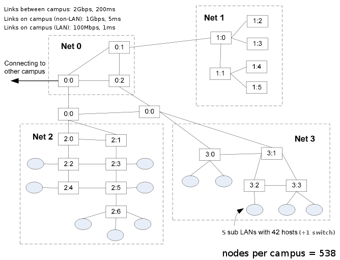

Nix-Vector Routing Documentation
--------------------------------

.. include:: replace.txt
.. highlight:: cpp

.. heading hierarchy:
   ------------- Chapter
   ************* Section (#.#)
   ============= Subsection (#.#.#)
   ############# Paragraph (no number)

Nix-vector routing is a simulation specific routing protocol and is 
intended for large network topologies.  The on-demand nature of this 
protocol as well as the low-memory footprint of the nix-vector provides 
improved performance in terms of memory usage and simulation run time 
when dealing with a large number of nodes.

Model Description
*****************

The source code for the NixVectorRouting module lives in
the directory ``src/nix-vector-routing``.

|ns3| nix-vector-routing performs on-demand route computation using 
a breadth-first search and an efficient route-storage data structure 
known as a nix-vector.

When a packet is generated at a node for transmission, the route is 
calculated, and the nix-vector is built.

**How is the Nix-Vector calculated?**
The nix-vector stores an index for each hop along the path, which 
corresponds to the neighbor-index.  This index is used to determine
which net-device and gateway should be used.

**How does the routing take place?**
To route a packet, the nix-vector must be transmitted with the packet.
At each hop, the current node extracts the appropriate neighbor-index
from the nix-vector and transmits the packet through the corresponding
net-device. This continues until the packet reaches the destination.

.. note::
   Nix-Vector routing does not use any routing metrics (interface metrics)
   during the calculation of nix-vector. It is only based on the shortest
   path calculated according to BFS.

**How does Nix decide between two equally short path from source to
destination?**
It depends on how the topology is constructed i.e., the order in which the
net-devices are added on a node and net-devices added on the channels
associated with current node's net-devices. Please check the ``nix-simple.cc``
example below to understand how nix-vectors are calculated.

|ns3| supports IPv4 as well as IPv6 Nix-Vector routing.

Scope and Limitations
=====================

Currently, the |ns3| model of nix-vector routing supports IPv4 and IPv6
p2p links, CSMA links and multiple WiFi networks with the same channel object.
It does not (yet) provide support for efficient adaptation to link failures.
It simply flushes all nix-vector routing caches.

NixVectorRouting performs a subnet matching check, but it does **not** check
entirely if the addresses have been appropriately assigned. In other terms,
using Nix-Vector routing, it is possible to have a working network that
violates some good practices in IP address assignments.

In case of IPv6, Nix assumes the link-local addresses assigned are **unique**.
When using the IPv6 stack, the link-local address allocation is unique by
default over the entire topology. However, if the link-local addresses are
assigned manually, the user must ensure uniqueness of link-local addresses.

Usage
*****

The usage pattern is the one of all the Internet routing protocols.
Since NixVectorRouting is not installed by default in the 
Internet stack, it is necessary to set it in the Internet Stack 
helper by using ``InternetStackHelper::SetRoutingHelper``.

Remember to include the header file ``ns3/nix-vector-helper.h`` to
use IPv4 or IPv6 Nix-Vector routing.

.. note::
   The previous header file ``ns3/ipv4-nix-vector-helper.h`` is
   maintained for backward compatibility reasons. Therefore, the
   existing IPv4 Nix-Vector routing simulations should work fine.

*  Using IPv4 Nix-Vector Routing:

.. code-block:: c++

   Ipv4NixVectorHelper nixRouting;
   InternetStackHelper stack;
   stack.SetRoutingHelper (nixRouting);  // has effect on the next Install ()
   stack.Install (allNodes);             // allNodes is the NodeContainer

*  Using IPv6 Nix-Vector Routing:

.. code-block:: c++

   Ipv6NixVectorHelper nixRouting;
   InternetStackHelper stack;
   stack.SetRoutingHelper (nixRouting);  // has effect on the next Install ()
   stack.Install (allNodes);             // allNodes is the NodeContainer

.. note::
   The NixVectorHelper helper class helps to use NixVectorRouting functionality.
   The NixVectorRouting model can also be used directly to use Nix-Vector routing.
   To use it directly, the header file ``ns3/nix-vector-routing.h`` should be
   included. The previous header file ``ns3/ipv4-nix-vector-routing.h`` is maintained
   for backwards compatibility with any existing IPv4 Nix-Vector routing simulations.

Examples
========

The examples for the NixVectorRouting module lives in
the directory ``src/nix-vector-routing/examples``.

There are examples which use both IPv4 and IPv6 networking.

*  nix-simple.cc

::

  /*
   *    ________
   *   /        \
   * n0 -- n1 -- n2 -- n3
   *
   * n0 IP: 10.1.1.1, 10.1.4.1
   * n1 IP: 10.1.1.2, 10.1.2.1
   * n2 IP: 10.1.2.2, 10.1.3.1, 10.1.4.2
   * n3 IP: 10.1.3.2
   */

In this topology, we install Nix-Vector routing between source
n0 and destination n3. The shortest possible route will be
n0 -> n2 -> n3.

Let's see how the nix-vector will be generated for this path:

n0 has 2 neighbors i.e. n1 and n3. n0 is connected to both using
separate net-devices. But the net-device for n0 -- n1 p2p link was
created before the netdevice for n0 -- n2 p2p link. Thus, n2 has
neighbor-index of 1 (n1 has 0) with respect to n0.

n2 has 3 neighbors i.e. n1, n3 and n0. The n2 net-device for n1 -- n2
p2p link was created before the n2 net-device for n2 -- n3 p2p link
which was before the n2 netdevice for n0 -- n2 p2p link. This, n3
has neighbor-index of 01 (n1 has 00 and n0 has 10) with repect to n2.

Thus, the nix-vector for the path from n0 to n3 is 101.

.. note::
   This neighbor-index or nix-index has total number of bits equal to
   minimum number of bits required to represent all the neighbors in
   their binary form.

.. note::
   If there are multiple netdevices connected to the current netdevice
   on the channel then it depends on which order netdevices were added
   to the channel.

   #. Using IPv4:
   .. code-block:: bash

      # By default IPv4 network is selected
      ./waf --run src/nix-vector-routing/examples/nix-simple

   #. Using IPv6:
   .. code-block:: bash

      # Use the --useIPv6 flag
      ./waf --run "src/nix-vector-routing/examples/nix-simple --useIPv6"

* nms-p2p-nix.cc

This example demonstrates the advantage of Nix-Vector routing as Nix
performs source-based routing (BFS) to have faster routing.

   #. Using IPv4:
   .. code-block:: bash

      # By default IPv4 network is selected
      ./waf --run src/nix-vector-routing/examples/nms-p2p-nix

   #. Using IPv6:
   .. code-block:: bash

      # Use the --useIPv6 flag
      ./waf --run "src/nix-vector-routing/examples/nms-p2p-nix --useIPv6"

*  nix-simple-multi-address.cc

This is an IPv4 example demonstrating multiple interface addresses. This
example also shows how address assignment in between the simulation causes
the all the route caches and Nix caches to flush.

.. code-block:: bash

   # By default IPv4 network is selected
   ./waf --run src/nix-vector-routing/examples/nix-simple-multi-address

*  nix-double-wifi.cc

This example demonstrates the working of Nix with two Wifi networks
operating on the same Wifi channel object. The example uses ``ns3::YansWifiChannel``
for both the wifi networks.

   #. Using IPv4:
   .. code-block:: bash

      # By default IPv4 network is selected
      ./waf --run src/nix-vector-routing/examples/nix-double-wifi
      # Use the --enableNixLog to enable NixVectorRouting logging.
      ./waf --run "src/nix-vector-routing/examples/nix-double-wifi --enableNixLog"

   #. Using IPv6:
   .. code-block:: bash

      # Use the --useIPv6 flag
      ./waf --run "src/nix-vector-routing/examples/nix-double-wifi --useIPv6"
      # Use the --enableNixLog to enable NixVectorRouting logging.
      ./waf --run "src/nix-vector-routing/examples/nix-double-wifi --useIPv6 --enableNixLog"