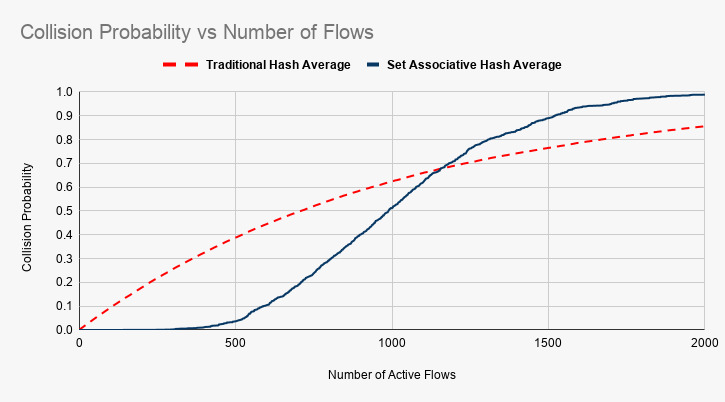
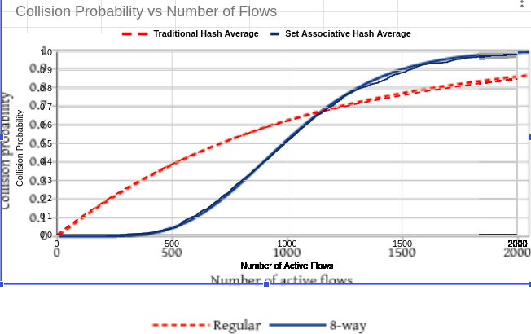

.. include:: replace.txt
.. highlight:: cpp
.. highlight:: bash

.. _sec-fq-codel:

FqCoDel queue disc
------------------

This chapter describes the FqCoDel ([Hoe16]_) queue disc implementation in |ns3|.

The FlowQueue-CoDel (FQ-CoDel) algorithm is a combined packet scheduler and
Active Queue Management (AQM) algorithm developed as part of the
bufferbloat-fighting community effort ([Buf16]_).
FqCoDel classifies incoming packets into different queues (by default, 1024
queues are created), which are served according to a modified Deficit Round
Robin (DRR) queue scheduler. Each queue is managed by the CoDel AQM algorithm.
FqCoDel distinguishes between "new" queues (which don't build up a standing
queue) and "old" queues, that have queued enough data to be around for more
than one iteration of the round-robin scheduler.

FqCoDel is installed by default on single-queue NetDevices (such as PointToPoint,
Csma and Simple). Also, on multi-queue devices (such as Wifi), the default root
qdisc is Mq with as many FqCoDel child queue discs as the number of device queues.

Model Description
*****************

The source code for the FqCoDel queue disc is located in the directory
``src/traffic-control/model`` and consists of 2 files `fq-codel-queue-disc.h`
and `fq-codel-queue-disc.cc` defining a FqCoDelQueueDisc class and a helper
FqCoDelFlow class. The code was ported to |ns3| based on Linux kernel code
implemented by Eric Dumazet.
Set associative hashing is also based on the Linux kernel `CAKE <https://ieeexplore.ieee.org/stamp/stamp.jsp?tp=&arnumber=8475045>`_ queue management code.
Set associative hashing is used to reduce the number of hash collisions in
comparison to choosing queues normally with a simple hash. For a given number of
queues, set associative hashing has fewer collisions than a traditional
hash, as long as the number of flows is lesser than the number of queues.
Essentially, it makes the queue management system more efficient. Set associative
hashing is a vital component of CAKE, which is another popular flow management
algorithm that is implemented in Linux and is being tested for FqCoDel.
Furthermore, this module can be directly used with CAKE when its other
components are implemented in ns-3. The only changes needed to incorporate this
new hashing scheme are in the SetAssociativeHash and DoEnqueue methods,
as described below.

* class :cpp:class:`FqCoDelQueueDisc`: This class implements the main FqCoDel algorithm:

  * ``FqCoDelQueueDisc::DoEnqueue()``: If no packet filter has been configured, this routine calls the QueueDiscItem::Hash() method to classify the given packet into an appropriate queue. Otherwise, the configured filters are used to classify the packet. If the filters are unable to classify the packet, the packet is dropped. Otherwise, an option is provided if set associative hashing is to be used.The packet is now handed over to the CoDel algorithm for timestamping. Then, if the queue is not currently active (i.e., if it is not in either the list of new or the list of old queues), it is added to the end of the list of new queues, and its deficit is initiated to the configured quantum. Otherwise,  the queue is left in its current queue list. Finally, the total number of enqueued packets is compared with the configured limit, and if it is above this value (which can happen since a packet was just enqueued), packets are dropped from the head of the queue with the largest current byte count until the number of dropped packets reaches the configured drop batch size or the backlog of the queue has been halved. Note that this in most cases means that the packet that was just enqueued is not among the packets that get dropped, which may even be from a different queue.

  * ``FqCoDelQueueDisc::SetAssociativeHash()``: An outer hash is identified for the given packet. This corresponds to the set into which the packet is to be enqueued. A set consists of a group of queues. The set determined by outer hash is enumerated; if a queue corresponding to this packet's flow is found (we use per-queue tags to achieve this), or in case of an inactive queue, or if a new queue can be created for this set without exceeding the maximum limit, the index of this queue is returned. Otherwise, all queues of this full set are active and correspond to flows different from the current packet's flow. In such cases, the index of first queue of this set is returned. We don’t consider creating new queues for the packet in these cases, since this approach may waste resources in the long run. The situation highlighted is a guaranteed collision and cannot be avoided without increasing the overall number of queues.

  * ``FqCoDelQueueDisc::DoDequeue()``: The first task performed by this routine is selecting a queue from which to dequeue a packet. To this end, the scheduler first looks at the list of new queues; for the queue at the head of that list, if that queue has a negative deficit (i.e., it has already dequeued at least a quantum of bytes), it is given an additional amount of deficit, the queue is put onto the end of the list of old queues, and the routine selects the next queue and starts again. Otherwise, that queue is selected for dequeue. If the list of new queues is empty, the scheduler proceeds down the list of old queues in the same fashion (checking the deficit, and either selecting the queue for dequeuing, or increasing deficit and putting the queue back at the end of the list). After having selected a queue from which to dequeue a packet, the CoDel algorithm is invoked on that queue. As a result of this, one or more packets may be discarded from the head of the selected queue, before the packet that should be dequeued is returned (or nothing is returned if the queue is or becomes empty while being handled by the CoDel algorithm). Finally, if the CoDel algorithm does not return a packet, then the queue must be empty, and the scheduler does one of two things: if the queue selected for dequeue came from the list of new queues, it is moved to the end of the list of old queues.  If instead it came from the list of old queues, that queue is removed from the list, to be added back (as a new queue) the next time a packet for that queue arrives. Then (since no packet was available for dequeue), the whole dequeue process is restarted from the beginning. If, instead, the scheduler did get a packet back from the CoDel algorithm, it subtracts the size of the packet from the byte deficit for the selected queue and returns the packet as the result of the dequeue operation.

  * ``FqCoDelQueueDisc::FqCoDelDrop()``: This routine is invoked by ``FqCoDelQueueDisc::DoEnqueue()`` to drop packets from the head of the queue with the largest current byte count. This routine keeps dropping packets until the number of dropped packets reaches the configured drop batch size or the backlog of the queue has been halved.

* class :cpp:class:`FqCoDelFlow`: This class implements a flow queue, by keeping its current status (whether it is in the list of new queues, in the list of old queues or inactive) and its current deficit.

In Linux, by default, packet classification is done by hashing (using a Jenkins
hash function) the 5-tuple of IP protocol, source and destination IP
addresses and port numbers (if they exist). This value modulo
the number of queues is salted by a random value
selected at initialization time, to prevent possible DoS attacks if the hash
is predictable ahead of time. Alternatively, any other packet filter can be
configured.
In |ns3|, packet classification is performed in the same way as in Linux.
Neither internal queues nor classes can be configured for an FqCoDel
queue disc.

Possible next steps
===================

* what to do if ECT(1) and either/both ECT(0) and NotECT are in the same flow queue (hash collisions or tunnels)-- our L4S traffic flows will avoid this situation by supporting AccECN and ECN++ (and if it happens in practice, the CoDel logic will just apply two separate thresholds)
* adding a ramp marking response instead of step threshold
* adding a floor value (to suppress marks if the queue length is below a certain number of bytes or packets)
* adding a heuristic such as in PIE to avoid marking a packet if it arrived to an empty flow queue (check on ingress, remember at egress time)

References
==========

.. [Hoe16] T. Hoeiland-Joergensen, P. McKenney, D. Taht, J. Gettys and E. Dumazet, The FlowQueue-CoDel Packet Scheduler and Active Queue Management Algorithm, IETF draft.  Available online at `<https://tools.ietf.org/html/draft-ietf-aqm-fq-codel>`_

.. [Buf16] Bufferbloat.net.  Available online at `<http://www.bufferbloat.net/>`_.

Attributes
==========

The key attributes that the FqCoDelQueue class holds include the following:

* ``UseEcn:`` True to use ECN (packets are marked instead of being dropped)
* ``Interval:`` The interval parameter to be used on the CoDel queues. The default value is 100 ms.
* ``Target:`` The target parameter to be used on the CoDel queues. The default value is 5 ms.
* ``MaxSize:`` The limit on the maximum number of packets stored by FqCoDel.
* ``Flows:`` The number of flow queues managed by FqCoDel.
* ``DropBatchSize:`` The maximum number of packets dropped from the fat flow.
* ``Perturbation:`` The salt used as an additional input to the hash function used to classify packets.
* ``CeThreshold`` The FqCoDel CE threshold for marking packets
* ``UseL4s`` True to use L4S (only ECT1 packets are marked at CE threshold)
* ``EnableSetAssociativeHash:`` The parameter used to enable set associative hash.

Perturbation is an optional configuration attribute and can be used to generate
different hash outcomes for different inputs.  For instance, the tuples
used as input to the hash may cause hash collisions (mapping to the same
bucket) for a given set of inputs, but by changing the perturbation value,
the same hash inputs now map to distinct buckets.

Note that the quantum, i.e., the number of bytes each queue gets to dequeue on
each round of the scheduling algorithm, is set by default to the MTU size of the
device (at initialisation time). The ``FqCoDelQueueDisc::SetQuantum ()`` method
can be used (at any time) to configure a different value.

Examples
========

A typical usage pattern is to create a traffic control helper and to configure type
and attributes of queue disc and filters from the helper. For example, FqCodel
can be configured as follows:

.. sourcecode:: cpp

   TrafficControlHelper tch;
   tch.SetRootQueueDisc("ns3::FqCoDelQueueDisc", "DropBatchSize", UintegerValue(1)
                                                "Perturbation", UintegerValue(256));
   QueueDiscContainer qdiscs = tch.Install(devices);

The example for FqCoDel's L4S mode is `FqCoDel-L4S-example.cc` located in ``src/traffic-control/examples``.  To run the file (the first invocation below shows the available
command-line options):

.. sourcecode:: bash

   $ ./ns3 run "FqCoDel-L4S-example --PrintHelp"
   $ ./ns3 run "FqCoDel-L4S-example --scenarioNum=5"

The expected output from the previous command are .dat files.

Validation
**********

The FqCoDel model is tested using :cpp:class:`FqCoDelQueueDiscTestSuite` class defined in `src/test/ns3tc/codel-queue-test-suite.cc`.  The suite includes 5 test cases:

* Test 1: The first test checks that packets that cannot be classified by any available filter are dropped.
* Test 2: The second test checks that IPv4 packets having distinct destination addresses are enqueued into different flow queues. Also, it checks that packets are dropped from the fat flow in case the queue disc capacity is exceeded.
* Test 3: The third test checks the dequeue operation and the deficit round robin-based scheduler.
* Test 4: The fourth test checks that TCP packets with distinct port numbers are enqueued into different flow queues.
* Test 5: The fifth test checks that UDP packets with distinct port numbers are enqueued into different flow queues.
* Test 6: The sixth test checks that the packets are marked correctly.
* Test 7: The seventh test checks the working of set associative hashing and its linear probing capabilities by using TCP packets with different hashes enqueued into different sets and queues.
* Test 8: The eighth test checks the L4S mode of FqCoDel where ECT1 packets are marked at CE threshold (target delay does not matter) while ECT0 packets continue to be marked at target delay (CE threshold does not matter).

The test suite can be run using the following commands:

.. sourcecode:: bash

   $ ./ns3 configure --enable-examples --enable-tests
   $ ./ns3 build
   $ ./test.py -s fq-codel-queue-disc

or:

.. sourcecode:: bash

   $ NS_LOG="FqCoDelQueueDisc" ./ns3 run "test-runner --suite=fq-codel-queue-disc"

Set associative hashing is tested by generating a probability collision graph.
This graph is then overlapped with the theoretical graph provided in the original
CAKE paper (refer to Figure 1 from `CAKE <https://ieeexplore.ieee.org/stamp/stamp.jsp?tp=&arnumber=8475045>`_).
The generated graph is linked below:

The overlapped graph is also linked below:

The steps to replicate this graph are available on this `link <https://github.com/AB261/Set-Associative-Hash-fqCodel>`_.
